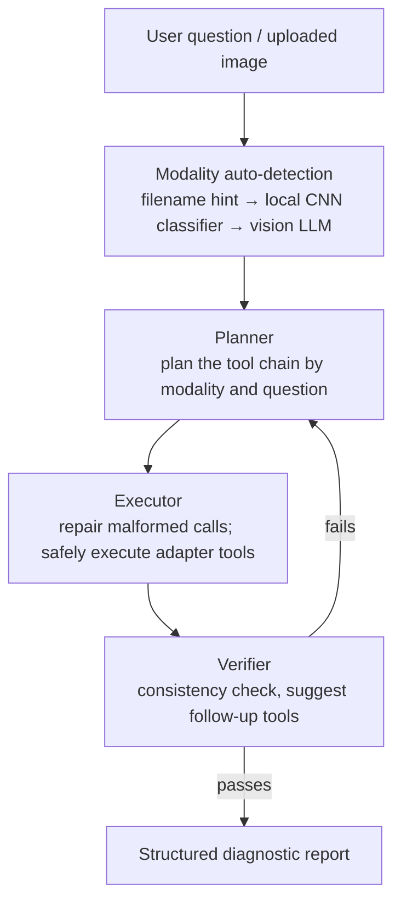

> **English** | [中文](README.zh-CN.md)

# OphAgent

## Overview

**OphAgent is a tool-using, multimodal ophthalmology assistant with a conversational Web UI.** It supports context-aware, multi-turn analysis: users can ask follow-up questions, inspect intermediate evidence, and reason across several images of the same eye. The agent remembers prior findings and tools already run instead of restarting the pipeline on every turn.

It covers four modalities, **color fundus photography (CFP)**, **OCT**, **ultra-wide-field fundus (UWF)** and **fluorescein angiography (FFA)**. Through dialogue it performs quality assessment, disease classification, lesion/vessel segmentation and cross-modal interpretation, and runs a consistency check before committing to a conclusion.

> For research and decision-support only. **Not a medical diagnosis.** All outputs must be confirmed by a qualified ophthalmologist together with the patient's history and examination.

### "Context" works on three levels

- **Multi-turn memory** — the full conversation history is kept, so you can ask follow-ups ("which quadrant is the hemorrhage mainly in?", "what would adding an OCT show?") without restating background.
- **Result reuse** — tool outputs already computed for an image are cached and reused on follow-ups, with no redundant recomputation.
- **Multi-image sessions** — attach several images of different modalities for the same eye in one session; the agent reasons across them jointly.

---

## Quick start

The shortest path to the code-only Web UI is:

```bash
git clone https://github.com/PyJulie/OphAgent.git
cd OphAgent
pip install -e .
ophagent-web
```

Open `http://127.0.0.1:8765`, then configure a provider, model, and API key
under **Personalize > API**. This starts the public code release; specialist
model tools become available after the separately distributed runtime assets
are installed. Continue to [Installation](#installation) for the full runtime
and [Reproducibility and safety checks](#reproducibility-and-safety-checks)
before treating a run as equivalent to the complete evaluation stack.

For command-line use, run `python demos/chat.py --configure-provider`.

## Tutorials

The bilingual, chapter-based tutorials cover the complete
planner-executor-verifier workflow, multimodal routing, Web deployment, and
model-adapter extension:

- [English tutorial](tutorials/en/index.md)
- [Simplified Chinese tutorial](tutorials/zh-CN/index.md)
- [Prompt architecture and runtime source map](docs/PROMPT_ARCHITECTURE.md)

---

## Features

- **Conversational and context-aware** — multi-turn interaction rather than a one-shot pipeline; remembers prior findings and executed tools, supports follow-ups and progressive drill-down.
- **Multi-modal coverage** — CFP / OCT / UWF / FFA, single-image or joint same-eye multi-modal analysis.
- **Planner → Executor → Verifier loop** — plan the tools needed, execute registered specialist models with bounded LLM-assisted invocation repair, and only emit a report after cross-checking; if verification fails it auto-orders more checks and re-plans.
- **Adapter-based tool registry** — each underlying model (classifier / segmenter / detector) is wrapped behind a uniform "tool" interface and dispatched by a registry; adding a model requires no change to the main loop.
- **Multi-classifier cross-validation** — within a modality, several independent models corroborate each other (e.g. CFP's three-way retinal CLIP ensemble, UWF's two classifiers), reducing single-point error.
- **Swappable chat brain** — choose an API gateway or a first-party OpenAI, Anthropic Claude, Google Gemini, or DashScope endpoint, then switch provider and model live from the Web UI or CLI.
- **Vision-impression fallback** — a vision-capable LLM can give an open-ended visual read, covering long-tail conditions the specialist classifiers have no head for.
- **Five execution policies** — low / medium / high provide increasingly thorough targeted runs; max adds a bounded debate verifier, and ultra evaluates every compatible tool with debate verification.
- **Web UI** — built-in chat interface with per-user session isolation, remembered provider/model/effort and API settings, history replay, and one-click export of a self-contained report page.

---

## Architecture



> Planner → Executor → Verifier forms a loop: on a failed check it returns to the Planner to order more tools and re-plan, until it passes or honestly reports "undetermined".

The implementation is organized around model adapters, orchestration,
verification, the Web service, and shared tool abstractions. See
[Repository layout](#repository-layout) for the source map.

---

## Tools by modality

| Modality | Tools |
|---|---|
| **CFP** | Image quality (EyeQ / EFIQA / robust quality), DR workup (PDR cascade + confound cross-check), three-way retinal CLIP ensemble, glaucoma workup (with morphometric cup-to-disc override), full-fundus multi-task segmentation & quantification, joint multi-disease classification |
| **OCT** | 16-class disease classification, fluid segmentation, retinal-layer segmentation, quality assessment |
| **UWF** | Multi-label disease classification, 7-class single-label classification, retinal vessel segmentation (with overlay visualization) |
| **FFA** | Disease classification, lesion detection, joint classification |
| **Cross-modal** | CFP+OCT joint, CFP+FFA joint, bilingual report generation |

---

## Installation

The [Quick start](#quick-start) installs the base package. See `pyproject.toml`
for dependencies (PyTorch, torchvision, timm, FastAPI, an OpenAI-compatible
SDK, etc.).

Install the optional OCT optic-disc runtime when that tool is required:

```bash
pip install -e ".[oct-disc]"
```

### Runtime assets

The GitHub repository intentionally contains no checkpoint files. The
`manuscript-full` configuration uses the separately distributed
`OphAgent-runtime-assets-0.1.0.zip` archive. Install it outside the checkout
with:

```bash
python reviewer/install_assets.py \
  --archive /path/to/OphAgent-runtime-assets-0.1.0.zip \
  --runtime-dir ~/ophagent-runtime
export OPHAGENT_RUNTIME_DIR=~/ophagent-runtime
```

The installer verifies the published archive size and SHA-256 before
extracting all 37 checkpoints. See
[`docs/RUNTIME_ASSETS.md`](docs/RUNTIME_ASSETS.md) for the complete Windows
and Linux procedure, provider configuration, component installation, and
validation sequence.

### Source components and weights

The repository is designed as a **code release with separately distributed
model assets**.
Redistributable public model code is installed at locked Git revisions, while
weights and private runtime data remain outside the checkout:

```bash
ophagent-components install --all
ophagent-components status --profile manuscript-full
```

ReT-SAM 2.0 and G-DISC inference source ships with OphAgent. RetiZero and FMUE
are installed from locked upstream revisions and require an explicit
acknowledgement because those revisions declare no license. See
[`docs/COMPONENTS.md`](docs/COMPONENTS.md) and
[`THIRD_PARTY.md`](THIRD_PARTY.md) before installation. The source/runtime
boundary and verification workflow are documented in
[`docs/REPRODUCIBILITY.md`](docs/REPRODUCIBILITY.md) and
[`docs/VALIDATION.md`](docs/VALIDATION.md).

### Release boundary

This repository **does not include model weights, credentials, datasets, or
generated results**. The public asset manifest records the expected path,
size, and SHA-256 for each weight. The code installs and imports without
weights, while preflight reports which tools are available. A runtime with
missing tools must not be interpreted as equivalent to the complete
evaluation configuration. Configure separately distributed assets through
`OPHAGENT_RUNTIME_DIR` and the checkpoint/source overrides documented in
`.env.example`.

---

## Configuration

Keep credentials, model weights, external model repositories, sessions, and
generated results outside the source checkout. Create a private runtime
directory, copy the template there, and point OphAgent at it. Without an
override, OphAgent uses `~/.ophagent`:

```bash
mkdir -p ~/ophagent-runtime
cp .env.example ~/ophagent-runtime/.env
export OPHAGENT_RUNTIME_DIR=~/ophagent-runtime
```

PowerShell equivalent:

```powershell
New-Item -ItemType Directory -Force "$HOME\ophagent-runtime"
Copy-Item .env.example "$HOME\ophagent-runtime\.env"
$env:OPHAGENT_RUNTIME_DIR = "$HOME\ophagent-runtime"
```

Key environment variables:

| Variable | Description |
|---|---|
| `OPH_WEB_BACKEND` | Chat provider: gateways `aigcbest` / `openrouter`; official APIs `openai` / `anthropic` / `gemini` / `dashscope` |
| `OPH_WEB_MODEL` | Main chat model id |
| `OPH_WEB_VISION_BACKEND` | Optional provider for a dedicated vision model; defaults to the chat backend |
| `OPH_WEB_VISION_MODEL` | Dedicated vision model (used for image impressions when the main model is text-only; left blank, it is skipped when unavailable) |
| `OPH_WEB_EFFORT` | Execution policy: `low` / `medium` / `high` / `max` / `ultra` |
| `*_API_KEY` | API key for the chosen backend |
| `WEB_USERNAME` / `WEB_PASSWORD` | Basic-auth credentials for the web UI |
| `OPHAGENT_RUNTIME_DIR` | Private root containing `.env`, `checkpoints/`, `external/`, `reports/`, and `cache/` |

The release runtime reads the `OPH_WEB_*` variables above for the Web UI. It does not use nested override names such as `OPHAGENT_LLM__MODEL_ID`; use `OPH_WEB_MODEL` for the Web UI, or the explicit `--model` argument in scripted evaluation entry points.

Authenticated Web UI users choose a provider from grouped gateway and
first-party sections, then select a model. They can set a provider API key and an optional
OpenAI-compatible Base URL in **Personalize > API**. These per-user credentials are
stored server-side under
`<OPHAGENT_RUNTIME_DIR>/config/web_api_credentials/`; the key itself is never
returned to the browser. Environment variables remain the fallback for CLI,
batch, and centrally managed deployments. A custom Base URL is accepted only
with that user's personal key, so a server-managed environment key cannot be
redirected to another endpoint.

Administrators can configure tool availability and checkpoint/source paths in
**Personalize > Tools**. The page distinguishes configured, missing, and
verified resources. **Check** validates file type and size, verifies SHA-256
when the private runtime manifest contains a digest, and checks required marker
files for external source directories. Enable/disable changes take effect for
new toolkits immediately; checkpoint path changes require a Web service
restart because model adapters resolve their weights during import. These
settings are stored outside the release repository at
`<OPHAGENT_RUNTIME_DIR>/config/checkpoints.json`. Non-administrator users cannot
view or change server filesystem paths.

> `.env` is excluded by `.gitignore`. **Never commit it.**

---

## Usage

**Web UI**

```bash
ophagent-web
# open http://127.0.0.1:8765 in your browser
```

After uploading an image you can converse over multiple turns; the agent keeps context:

```
You: Interpret this fundus image.
Assistant: (auto-detects CFP → runs quality assessment, DR workup, CLIP ensemble, segmentation, verifies)
           Primary diagnosis: diabetic retinopathy (moderate NPDR) ...

You: Where is the hemorrhage mainly located?
Assistant: (reuses the previous segmentation, no re-run) Mainly posterior pole and infero-temporal; within 2 disc diameters of the macula there are ...

You: Show me the vessel segmentation.
Assistant: (calls vessel segmentation and embeds the overlay)
```

**Command line**

```bash
python demos/chat.py          # full multimodal OphSession
python demos/chat.py --configure-provider  # guided provider/model setup
```

The command-line and Web interfaces use the same `OphSession` runtime,
including multimodal routing, configurable execution effort, specialist tools,
and verification. The guided CLI requests a missing key with hidden input and
uses it only for that process. Run `python demos/chat.py --help` for provider and
role-specific model options.

## Reproducibility and safety checks

After placing separately supplied weights under the private runtime, verify
their size and SHA-256 against the packaged public manifest:

```bash
ophagent-assets verify --profile manuscript-full
ophagent-components status --profile manuscript-full
```

Before interpreting a local run as the full evaluation pipeline, run the preflight check:

```bash
python -m ophagent.preflight --json --no-save-json
```

The full command probes the effective planner model selected by
`OPH_WEB_BACKEND` and `OPH_WEB_MODEL`. If a separate vision provider or model
is configured, it probes that exact pair as well. Command-line arguments take
precedence over environment values, for example:

```bash
python -m ophagent.preflight \
  --backend dashscope --model qwen3-vl-plus \
  --vision-backend aigcbest --vision-model gpt-5-mini \
  --effort high --json --no-save-json
```

Expected behaviour:

- Exit code `0` from the full check means the configured runtime stack loaded successfully.
- Exit code `1` means at least one required component is missing or failed. In a code-only checkout without all weights, this is expected and indicates that the run is a public demonstration or degraded configuration, not the manuscript evaluation pipeline.
- The JSON report records the effective planner, vision, and effort settings together with their configuration sources, backend probe results, adapter registration/probing status, external tool paths, and per-modality core-tool coverage. It never includes API-key values.

Use `--quick` to validate the selected provider credentials, imports, and
adapter registration without making an LLM request or loading adapter
checkpoints. It therefore never claims strict runtime readiness.

Run the deterministic offline safety checks separately:

```bash
python -m ophagent.reviewer_smoke
```

They exercise invalid, non-ophthalmic, and scope-unverified input refusal;
complete core-observer failure suppression; and the unchanged no-new-tool
finalization path. A
successful run returns JSON with `"ok": true`; it is a safety-control test, not
a substitute for the full component preflight or a diagnostic-accuracy test.
See [`docs/VALIDATION.md`](docs/VALIDATION.md) for the command sequence,
expected fields, and scope of each check.

The Web UI is the recommended interactive test entry point:

```bash
ophagent-web
```

The UI exposes the active backend/model/vision-model/effort configuration,
per-user API settings, and
administrator checkpoint controls; it supports multi-turn context, shows the
live tool trace, and can export a session report. A session should only be
treated as a full-pipeline diagnostic run when the required keys, weights,
adapter paths, and preflight checks are satisfied; otherwise
degraded/refusal/insufficient-data states are part of the expected safety
behaviour.

---

## Security & deployment

- The web server binds to `127.0.0.1` by default; binding to a public interface requires authentication to be set.
- Expose it via a reverse proxy / tunnel with an additional access-control layer; never expose the port directly.
- Sessions are isolated per user; VRAM-heavy tools such as segmentation are serialized to avoid GPU contention when multiple users call them at once.

---

## Repository layout

```
OphAgent/
├── ophagent/         # core code
│   ├── adapters/     # model adapters + registry
│   ├── chat/         # session engine & orchestration
│   ├── webchat/      # web service
│   ├── agent/        # tool abstractions
│   └── training/     # training components
├── demos/            # public application entry points
├── configs/          # config templates
├── tutorials/        # English and Chinese Markdown tutorials
├── pyproject.toml
├── .env.example
└── README.md
```

---

## License

**Non-commercial use only** (academic research / teaching / personal evaluation). Any commercial use is prohibited; contact the author for commercial licensing. See `LICENSE`.
