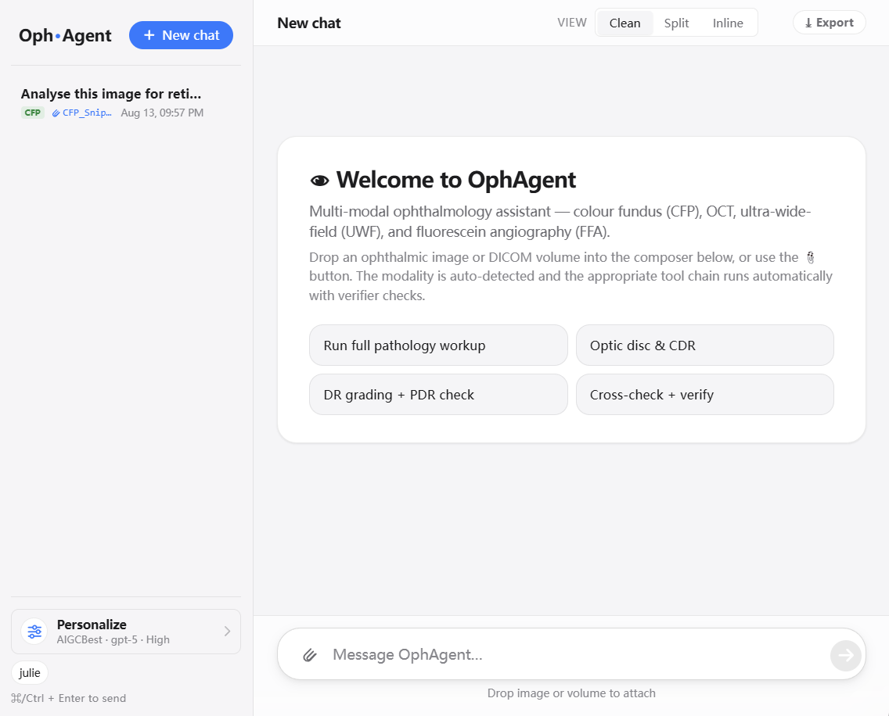
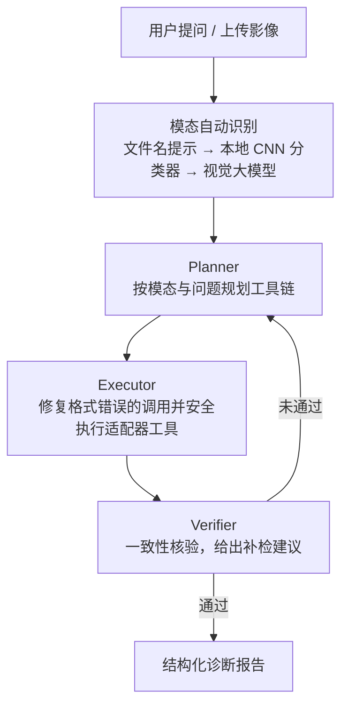

> [English](README.md) | **中文**

# OphAgent

## 概览

**OphAgent 是带工具调度能力的多模态眼科助手，并提供对话式 Web UI。** 它支持带上下文记忆的多轮分析：用户可以追问、检查中间证据，并围绕同一只眼的多张影像持续推理。系统会记住此前的发现与已运行工具，而不是每次从零开始。

目前支持**彩色眼底照相（CFP）**、**OCT**、**超广角眼底（UWF）**与**荧光素血管造影（FFA）**四种模态，并为不同模态配置相应模型。通过对话即可完成质量评估、疾病分类、病灶/血管分割与跨模态联合解读，并在给出结论前自动做一致性核验。

## 交互式 Web 界面

OphAgent 提供用于分析眼科影像的对话式 Web 界面。用户可以上传影像、提出自由形式的临床问题、选择模型供应商和推理配置，并导出结构化报告。界面会自动识别影像模态，并可通过 Clean、Split 或 Inline 视图呈现工具执行与验证过程。



---

## 快速开始

启动代码版网页端的最短路径是：

```bash
git clone https://github.com/PyJulie/OphAgent.git
cd OphAgent
pip install -e .
ophagent-web
```

浏览器打开 `http://127.0.0.1:8765`，然后在 **个性化 > API** 中配置供应方、
模型和 API 密钥。这会启动公开代码版；安装单独分发的运行资产后，
专用模型工具才会可用。如需完整运行环境，继续阅读[安装](#安装)；在将本地运行
视为完整评估配置前，请完成[运行前检查](#运行前检查)。

命令行用户可运行 `python demos/chat.py --configure-provider`。

## 教程

双语分章教程覆盖完整的 Planner–Executor–Verifier 工作流、多模态路由、
Web 部署和模型适配器扩展：

- [简体中文教程](tutorials/zh-CN/index.md)
- [English tutorial](tutorials/en/index.md)
- [Prompt 架构与运行时源码导航](docs/PROMPT_ARCHITECTURE.md)

---

## 特性

- **对话式、带上下文**：多轮交互而非一次性流水线，记住此前发现与已跑工具，支持追问与逐步深入。
- **多模态覆盖**：CFP / OCT / UWF / FFA，单图或同眼多模态联合分析。
- **Planner → Executor → Verifier 工作流**：规划所需工具 → 由具备受约束 LLM 调用修复能力的 Executor 执行专用模型 → 交叉核验后才出报告；核验不通过会自动补检并重规划。
- **适配器式工具注册**：每个底层模型（分类器 / 分割器 / 检测器）封装成统一接口的「工具」，由注册表统一调度，新增模型无需改主流程。
- **多分类器交叉验证**：同一模态下多个独立模型互为印证（如 CFP 的三路视网膜 CLIP 集成、UWF 的双分类器），降低单点误判。
- **可切换的对话大脑**：先选择 API 网关或官方 API，再选择具体供应方与模型；支持 OpenAI、Anthropic Claude、Google Gemini、DashScope、AIGCBest 和 OpenRouter，并可在网页端或 CLI 实时切换。
- **视觉印象兜底**：可调用具备视觉能力的大模型做开放式影像描述，覆盖专用分类器没有训练头的长尾病种。
- **五档执行策略**：low / medium / high 逐步增加有针对性的工具调用；max 加入有边界的 debate verifier，ultra 调用全部兼容工具并进行 debate 核验。
- **网页端**：内置 Web 对话界面，支持会话隔离、按用户记忆模型/强度偏好、历史回放、一键导出自包含的报告页。

---

## 架构概览



> Planner → Executor → Verifier 形成闭环：核验不通过时回到 Planner 补检并重规划，直到通过或如实标注"不确定"。

实现围绕模型适配器、工具编排与核验、Web 服务和共享工具抽象组织。
源码导航见[目录结构](#目录结构)。

---

## 支持的工具（按模态）

| 模态 | 工具 |
|---|---|
| **CFP** | 图像质量（EyeQ / EFIQA / 鲁棒质量）、DR 工作流（PDR 级联 + 混淆交叉校验）、三路视网膜 CLIP 集成、青光眼工作流（含形态学杯盘比覆盖）、全眼底多任务分割与量化、联合多病种分类 |
| **OCT** | 16 类疾病分类、积液分割、视网膜分层分割、质量评估 |
| **UWF** | 多标签疾病分类、7 类单标签疾病分类、视网膜血管分割（叠加图可视化） |
| **FFA** | 病种分类、病灶检测、联合分类 |
| **跨模态** | CFP+OCT 联合、CFP+FFA 联合、双语报告生成 |

---

## 安装

[快速开始](#快速开始)已完成基础包安装。完整依赖见 `pyproject.toml`（PyTorch、torchvision、
timm、FastAPI、OpenAI 兼容 SDK 等）。

如需运行 OCT 视盘定量分析，请同时安装对应的可选依赖：

```bash
pip install -e ".[oct-disc]"
```

### 运行资产

GitHub 仓库不包含任何 checkpoint。`manuscript-full` 配置使用单独分发的
`OphAgent-runtime-assets-0.1.0.zip`，请将其安装到仓库之外：

```bash
python reviewer/install_assets.py \
  --archive /path/to/OphAgent-runtime-assets-0.1.0.zip \
  --runtime-dir ~/ophagent-runtime
export OPHAGENT_RUNTIME_DIR=~/ophagent-runtime
```

安装器会先核对公开记录的压缩包大小和 SHA-256，再解压全部 37 个 checkpoint。
Windows 与 Linux 的完整步骤、供应商配置、外部组件安装及验证流程见
[`docs/RUNTIME_ASSETS.zh-CN.md`](docs/RUNTIME_ASSETS.zh-CN.md)。

### 外部源码与模型权重

本仓库采用**代码公开、模型资产单独分发**的发布方式。允许再分发的公开模型源码会按锁定的
Git 提交安装；权重、数据集、凭据和运行结果均保存在源码目录之外：

```bash
ophagent-components install --all
ophagent-components status --profile manuscript-full
```

ReT-SAM 2.0 与 G-DISC 的推理源码已随 OphAgent 发布。RetiZero 与 FMUE
从锁定的上游提交安装，但这些提交未声明许可证，因此需要使用者审阅条款并明确确认后才能拉取。安装前请阅读
[`docs/COMPONENTS.md`](docs/COMPONENTS.md) 与
[`THIRD_PARTY.md`](THIRD_PARTY.md)。源码与运行目录的边界及验证流程见
[`docs/REPRODUCIBILITY.md`](docs/REPRODUCIBILITY.md) 和
[`docs/VALIDATION.md`](docs/VALIDATION.md)。

### 发布边界

本仓库**不包含模型权重、密钥、数据集或生成结果**。公开资产清单记录每个权重的
预期路径、大小和 SHA-256。代码在没有权重时仍可安装和导入，预检程序会列出
当前可用工具。缺失工具的运行环境不能视为与完整评估配置等价。单独分发的资产通过
`OPHAGENT_RUNTIME_DIR` 以及 `.env.example` 中记录的 checkpoint/源码路径变量进行配置。

---

## 配置

密钥、模型权重、外部模型源码、会话和生成结果应存放在代码仓库之外。创建一个私有运行目录，将配置模板复制到其中，再通过环境变量连接。未显式设置时，OphAgent 默认使用 `~/.ophagent`：

```bash
mkdir -p ~/ophagent-runtime
cp .env.example ~/ophagent-runtime/.env
export OPHAGENT_RUNTIME_DIR=~/ophagent-runtime
```

PowerShell：

```powershell
New-Item -ItemType Directory -Force "$HOME\ophagent-runtime"
Copy-Item .env.example "$HOME\ophagent-runtime\.env"
$env:OPHAGENT_RUNTIME_DIR = "$HOME\ophagent-runtime"
```

主要环境变量：

| 变量 | 说明 |
|---|---|
| `OPH_WEB_BACKEND` | 对话供应方：网关 `aigcbest` / `openrouter`；官方 API `openai` / `anthropic` / `gemini` / `dashscope` |
| `OPH_WEB_MODEL` | 主对话模型 ID |
| `OPH_WEB_VISION_BACKEND` | 专用视觉模型的可选后端；默认沿用主对话后端 |
| `OPH_WEB_VISION_MODEL` | 专用视觉模型（当主模型为纯文本时用于影像印象；留空则在不可用时跳过） |
| `OPH_WEB_EFFORT` | 执行策略：`low` / `medium` / `high` / `max` / `ultra` |
| `*_API_KEY` | 对应后端的密钥 |
| `WEB_USERNAME` / `WEB_PASSWORD` | 网页端基础认证 |
| `OPHAGENT_RUNTIME_DIR` | 私有运行目录，其中可放置 `.env`、`checkpoints/`、`external/`、`reports/` 和 `cache/` |

网页端只读取上述 `OPH_WEB_*` 配置；嵌套变量
`OPHAGENT_LLM__MODEL_ID` 不是该路径支持的覆盖方式。预检命令可用
`--backend`、`--model`、`--vision-backend`、`--vision-model` 和
`--effort` 显式覆盖环境值。

已认证的网页用户可在按“多模型网关/官方供应方”分组的列表中直接选择供应方及模型，并在
**个性化 > API** 中为不同供应方设置个人 API
密钥和可选的 OpenAI 兼容 Base URL。密钥仅保存在服务端的
`<OPHAGENT_RUNTIME_DIR>/config/web_api_credentials/`，不会返回浏览器；页面只会显示
当前使用的是服务端环境配置、个人配置，还是尚未配置。

管理员可在 **个性化 > 工具** 中启用或关闭工具组，并配置 checkpoint 或外部源码路径。
页面区分可用、缺失和已校验状态；**检查**会核对文件类型与大小，在私有运行目录清单
包含摘要时校验 SHA-256，并检查外部源码目录所需的标志文件。启用/关闭会立即应用到新建
的工具实例；路径变更需要重启网页服务，因为模型适配器会在导入时解析权重路径。设置保存
在 `<OPHAGENT_RUNTIME_DIR>/config/checkpoints.json`，不进入发布仓库。非管理员无法查看或
修改服务器文件路径。

> `.env` 已被 `.gitignore` 排除，**切勿提交**。

---

## 运行

**网页端**

```bash
ophagent-web
# 浏览器打开 http://127.0.0.1:8765
```

上传影像后即可多轮对话，agent 会保留上下文：

```
你：解读这张眼底图。
助手：（自动识别为 CFP → 跑质量评估、DR 工作流、CLIP 集成、分割并核验）
      主要诊断：糖尿病视网膜病变（中度 NPDR）……

你：出血主要在哪个区域？
助手：（复用上一步的分割结果，无需重跑）后极部及颞下方为主，黄斑 2 个视盘直径内有 …

你：把血管分割图给我看看。
助手：（调用血管分割并内嵌叠加图）
```

**命令行**

```bash
python demos/chat.py          # 完整多模态 OphSession 交互
python demos/chat.py --configure-provider  # 从分组列表选择供应方与模型
```

命令行与网页端使用相同的 `OphSession` 运行时，包括多模态路由、可配置执行强度、
专用工具调用与结果核验。分步配置会以隐藏输入读取缺失的 API 密钥，并且只在本次
进程内使用。运行 `python demos/chat.py --help` 可查看供应方及各角色模型配置。

## 运行前检查

将单独获得的权重放入私有运行目录后，先根据公开清单核对文件大小和 SHA-256：

```bash
ophagent-assets verify --profile manuscript-full
ophagent-components status --profile manuscript-full
```

将本地运行视为完整评估栈之前，应执行实际模型加载检查：

```bash
python -m ophagent.preflight --json --no-save-json
```

完整检查会探测实际选中的 planner 模型；配置了不同的视觉后端或模型时，也会探测该组合。它返回 `0` 表示本次完整检查全部通过并设置 `strict_ready=true`；返回 `1` 时，JSON 会列出失败组件。

`--quick` 只检查所选后端是否配置了凭据、代码导入和适配器注册，不发送 LLM 请求，也不加载适配器权重。其 `strict_ready` 和 `strict_stack_probed` 始终为 `false`，因此 quick 通过不能被解释为完整运行栈已就绪。

无需 API、模型权重或临床数据的固定安全检查可单独运行：

```bash
python -m ophagent.reviewer_smoke
```

成功时返回退出码 `0` 和包含 `"ok": true` 的 JSON。该命令检查无效输入、非眼科输入及无法验证眼科范围时的拒绝，核心观察器全部失败时的诊断抑制，以及无新工具调用的最终化路径；它不替代完整预检或诊断性能验证。完整命令、字段及各项检查的适用范围见 `docs/VALIDATION.md`。

---

## 安全与部署

- 网页端默认仅绑定 `127.0.0.1`；绑定到公网接口时强制要求设置认证。
- 推荐通过反向代理 / 隧道对外暴露，并叠加访问控制；切勿直接暴露端口。
- 会话按用户隔离；分割等显存密集型工具做了并发串行化，避免多人同时调用时的显存竞争。

---

## 目录结构

```
OphAgent/
├── ophagent/        # 核心代码
│   ├── adapters/     # 模型适配器 + 注册表
│   ├── chat/         # 会话引擎与编排
│   ├── webchat/      # 网页服务
│   ├── agent/        # 工具抽象
│   └── training/     # 训练组件
├── demos/            # 公开应用入口
├── configs/          # 配置模板
├── tutorials/        # 中英文 Markdown 教程
├── pyproject.toml
├── .env.example
└── README.md
```

---

## 许可证

**仅限非商业使用**（学术研究 / 教学 / 个人评估）。禁止任何商业用途；商业授权请联系作者。详见 `LICENSE`。
