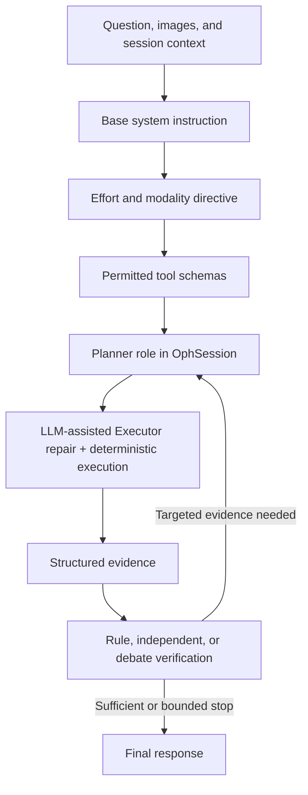

# OphAgent Prompt Architecture

This document maps the instruction surfaces used by OphAgent to their source
files, runtime call sites, invocation conditions, and workflow roles. OphAgent
does not obtain its behaviour from one monolithic prompt. The main runtime
assembles model instructions from a base system prompt, an execution policy,
the current modality and task context, callable tool schemas, structured
evidence requirements, and the configured verification mode.

## Scope

The primary interactive runtime is `OphSession`, which is used by both the Web
UI in `ophagent/webchat/server.py` and the terminal CLI in
`ophagent/chat/cli.py`. The repository also retains older OCT-only runtime code
for compatibility. Those surfaces are listed separately below so that a prompt
from an older demonstration is not mistaken for the complete multimodal
runtime.

This document describes inspectable instructions and control flow. It does not
expose private chain-of-thought, API credentials, patient data, or model
weights.

## Runtime assembly

For the standard interactive workflow, `OphSession.chat(...)` constructs the
model request in the following order:

1. Select the standard system prompt or an explicitly requested prompt profile.
2. Append the directive associated with the configured effort policy.
3. Add current images, modality state, prior evidence, and the user's question.
4. Expose only the tool schemas permitted by the active profile and runtime.
5. Dispatch structured tool calls through deterministic modality and policy
   guards.
6. Return structured tool evidence to the model.
7. Apply the configured verifier mode and, when necessary, permit bounded
   evidence collection and re-verification.
8. Finalise only when the controller's evidence and stopping conditions are
   satisfied, or return an explicit limited or unresolved result.

## Prompt and instruction inventory

| Prompt family | Definition or source | Runtime call site | Invocation condition | Workflow role |
|---|---|---|---|---|
| Main multimodal system instruction | `OPH_SYSTEM_PROMPT` in `ophagent/chat/oph_session.py` | `OphSession.chat(...)` | Standard prompt profile in the main Web UI or `OphSession` runtime | Defines the Planner-Executor-Verifier contract, evidence use, multimodal scope, verification, and response boundaries |
| Effort and modality directives | `_effort_directive(...)` and its policy-specific templates in `ophagent/chat/oph_session.py`; policy values in `ophagent/chat/run_policy.py` | Appended during request construction in `OphSession.chat(...)` | Every main-runtime request; content depends on `low`, `medium`, `high`, `max`, or `ultra`, the detected modality, and available vision capability | Bounds planning rounds, tool breadth, verification mode, targeted escalation, and stopping behaviour |
| Focused evaluation profiles | `COMPACT_MAC_SYSTEM_PROMPT`, `TASK_FOCUSED_DR_SYSTEM_PROMPT`, schema selectors, and result projections in `ophagent/chat/prompt_profiles.py` | Selected by `OphSession.chat(...)`; also used by `ophagent/evaluation/runner.py` | An evaluation explicitly sets `prompt_profile`; the default remains `standard` | Reduces unrelated prompt and schema context for a declared task without bypassing modality, evidence, or verification guards |
| Executor repair role | Repair contract in `ophagent/chat/executor_role.py`; role dispatch in `OphSession._executor_repair_tool_call(...)` | Invoked by `OphSession.chat(...)` after an eligible failed tool invocation | Malformed JSON, missing required arguments, invalid argument types, or other schema-level invocation failures | Repairs the attempted registered tool call once; deterministic schema, modality, and policy gates approve the retry, while backend and resource failures remain explicit failures |
| CFP stage 1 observation | `STAGE1_SYSTEM`, `stage1_user_prompt(...)`, and `STAGE1_SCHEMA` in `ophagent/chat/vision_prompts/cfp.py` | Dispatched by the visual interpretation tool path in `ophagent/chat/oph_tools.py` | Targeted visual interpretation of a CFP image | Produces a structured, morphology-first observation before disease synthesis |
| CFP stage 2 synthesis | `STAGE2_SYSTEM_TEMPLATE`, `stage2_system_prompt(...)`, `stage2_user_prompt(...)`, and `STAGE2_SCHEMA` in `ophagent/chat/vision_prompts/cfp.py` | Follows valid CFP stage 1 output | CFP interpretation requires disease-level synthesis from morphology and available tool context | Maps observed morphology and structured evidence to a bounded differential |
| OCT stage 1 observation | `STAGE1_SYSTEM`, `stage1_user_prompt(...)`, and `STAGE1_SCHEMA` in `ophagent/chat/vision_prompts/oct.py` | Dispatched by the visual interpretation tool path in `ophagent/chat/oph_tools.py` | Targeted visual interpretation of an OCT image | Describes retinal structure and abnormalities without prematurely forcing a diagnosis |
| OCT stage 2 synthesis | `STAGE2_SYSTEM_TEMPLATE`, `OCT_RUBRIC`, `stage2_system_prompt(...)`, and `stage2_user_prompt(...)` in `ophagent/chat/vision_prompts/oct.py` | Follows valid OCT stage 1 output | OCT morphology must be integrated with tool evidence and mapped to diagnostic entities | Performs morphology-to-entity synthesis while retaining conflicting or insufficient evidence |
| UWF stage 1 observation | `STAGE1_SYSTEM`, `stage1_user_prompt(...)`, and `STAGE1_SCHEMA` in `ophagent/chat/vision_prompts/uwf.py` | Dispatched by the visual interpretation tool path in `ophagent/chat/oph_tools.py` | Targeted visual interpretation of a UWF image | Captures peripheral and posterior-pole morphology in a structured form |
| UWF stage 2 synthesis | `STAGE2_SYSTEM_TEMPLATE`, `UWF_RUBRIC`, `stage2_system_prompt(...)`, and `stage2_user_prompt(...)` in `ophagent/chat/vision_prompts/uwf.py` | Follows valid UWF stage 1 output | UWF observations require disease-level integration with available tool context | Converts distributed UWF findings into a bounded differential and evidence summary |
| Cross-modality evidence rubric | Entity definitions and evidence constraints in `ophagent/chat/vision_prompts/_evidence_rubric.py` | Imported by modality-specific vision prompts and their validators | A supported entity requires structured evidence interpretation | Standardises the findings that support, weaken, or contradict each diagnostic entity |
| Vision-only scoped interpretation | `SYSTEM_PROMPTS`, `get_system_prompt(...)`, and `build_user_prompt(...)` in `ophagent/chat/vision_prompts/vision_only.py` | `OphSession` vision-only path | A supported visual question is routed to a bounded vision path without the full specialist-tool workflow | Provides a scoped visual interpretation while preserving task and output limits |
| Vision capability probe | `PROBE_PROMPT` in `ophagent/chat/vision_prompts/capability_probe.py` | Provider/model capability check before visual use | Vision capability for the selected model is unknown or requires confirmation | Verifies that the configured model can process image input before clinical visual prompting |
| Structured verifier contract | `verify_findings` schema and deterministic checks in `ophagent/chat/oph_tools.py`; effort mapping in `ophagent/chat/run_policy.py` | Called and validated by `OphSession.chat(...)` | Required by the configured effort policy or controller evidence gate | Checks evidence availability, quality, agreement, coverage, freshness, and permitted next actions |
| Independent verifier review | `_INDEP_VERIFIER_SYS` and `_independent_verifier_review(...)` in `ophagent/chat/oph_tools.py` | Invoked inside `verify_findings` | The effort policy selects `independent_llm`, or the role is explicitly enabled | Reviews raw structured evidence separately from the Planner and can identify conflict or insufficiency |
| Debate verifier | `_DEBATE_CHALLENGER_SYS`, `_DEBATE_DEFENDER_SYS`, `_DEBATE_JUDGE_SYS`, and `_run_debate(...)` in `ophagent/chat/oph_tools.py` | Invoked inside `verify_findings` | The effort policy selects bounded debate, currently `max` or `ultra` | Challenges the leading interpretation, evaluates the defence, and returns a bounded evidence-based judgement or targeted request |
| Task protocol prompts | `TaskProtocol`, `EvidenceRequirement`, and declared task protocols in `ophagent/evaluation/protocols.py` | Rendered by `ophagent/evaluation/runner.py` and task-specific evaluation entry points | A reproducible evaluation invokes a declared task protocol | Fixes the task endpoint, required evidence fields, effort semantics, and machine-readable output schema |
| Tool schemas and descriptions | Tool registrations and schemas in `ophagent/chat/oph_tools.py`; adapter metadata in `ophagent/adapters/` | Exposed to the Planner by `OphToolKit.get_all_schemas()` | A tool is registered, available, modality-compatible, and permitted by the active profile | Defines callable actions, typed arguments, output expectations, and capability boundaries |

## Why tool schemas and controller policy matter

Tool descriptions are part of the model-visible instruction surface, but the
controller does not rely on model compliance alone. `OphSession` applies
code-level checks for:

- modality compatibility;
- required fresh-image evidence;
- effort-specific planning and verification budgets;
- repeated or redundant calls;
- verifier-requested next actions;
- stale verification after new evidence;
- failed, skipped, interrupted, or unavailable tools;
- evidence-sufficiency and safe-stopping states.

The effective workflow is therefore defined by the combination of prompts,
schemas, structured outputs, and deterministic controller state.

## Modality-specific two-stage interpretation

CFP, OCT, and UWF visual interpretation use a two-stage structure:

1. **Observation stage:** describe visible morphology in a structured schema.
2. **Synthesis stage:** integrate the observation with available specialist
   tool evidence and map it to a differential or task-specific endpoint.

The separation reduces premature diagnostic anchoring and makes the observed
features available for validation before disease-level synthesis. Each module
also provides schema and consistency validators for its structured output.

## Verification and re-planning

Verification is selected by the execution policy:

| Effort | Main verification mode | Expected behaviour |
|---|---|---|
| `low` | Controller evidence gate | One bounded planning round and no LLM verifier escalation |
| `medium` | Structured rule verifier | Core evidence collection followed by a terminal structured check |
| `high` | Independent LLM verifier | Independent review of raw tool evidence with bounded targeted follow-up |
| `max` | Debate verifier | Targeted planning with bounded challenger, defender, and judge review |
| `ultra` | Debate verifier with exhaustive compatible tools | Upper-bound workflow that evaluates every compatible tool before bounded debate |

If verification returns unresolved issues or permitted `next_actions`,
`OphSession` can execute the requested evidence tool and verify again within
the configured escalation budget. Exhausting that budget produces a bounded
response rather than an unverified high-confidence conclusion.

## Prompt profiles used for evaluation

The standard profile preserves the full interactive runtime. Focused profiles
are opt-in evaluation configurations:

- `compact-mac` limits prompt and schema context to the fixed MAC multilabel
  endpoint while retaining evidence, verification, and safety contracts.
- `task-focused-dr` declares the evidence streams and output requirements for
  single-image ICDR grading.

`tests/test_prompt_profiles.py` checks profile normalisation, required tool
availability, schema selection, preservation of safety instructions, and
projection of tool results. Evaluation reports should record the selected
profile explicitly.

## Legacy and compatibility prompt surfaces

The repository retains two earlier OCT-oriented paths:

| Surface | Source | Entry point | Status |
|---|---|---|---|
| OCT-only conversational prompt | `CHAT_SYSTEM_PROMPT` in `ophagent/chat/prompts.py` | `ChatSession` in `ophagent/chat/session.py` | Retained compatibility runtime; the terminal CLI now uses `OphSession` |
| Standalone OCT agent prompt | `SYSTEM_PROMPT` and `ANALYSIS_PROMPT_TEMPLATE` in `ophagent/agent/prompts/system_prompt.py` | `ophagent/agent/engine.py` | Separate OCT workflow retained alongside the main runtime |

The Web UI and terminal CLI both create `OphSession`. Results attributed to the
complete multimodal OphAgent workflow should therefore be reproduced through
either interface or a task-specific evaluation entry point.

## Source-oriented reading path

For a compact audit of the active runtime, read the following in order:

1. `ophagent/chat/oph_session.py`
2. `ophagent/chat/run_policy.py`
3. `ophagent/chat/prompt_profiles.py`
4. `ophagent/chat/vision_prompts/`
5. `ophagent/chat/oph_tools.py`
6. `ophagent/evaluation/protocols.py`

The corresponding architecture explanations are available in:

- `tutorials/en/05_planning_and_effort_policies.md`
- `tutorials/en/06_executor_and_evidence.md`
- `tutorials/en/07_verification_and_safe_stopping.md`

Chinese-language counterparts are provided under `tutorials/zh-CN/`.

## Maintenance

Changes to a prompt family should be accompanied by:

1. an update to the relevant source map in this document;
2. tests for any profile, schema, or safety contract affected by the change;
3. an update to the corresponding tutorial when runtime behaviour changes;
4. an explicit prompt profile and effective runtime configuration in any
   reproducibility report.
