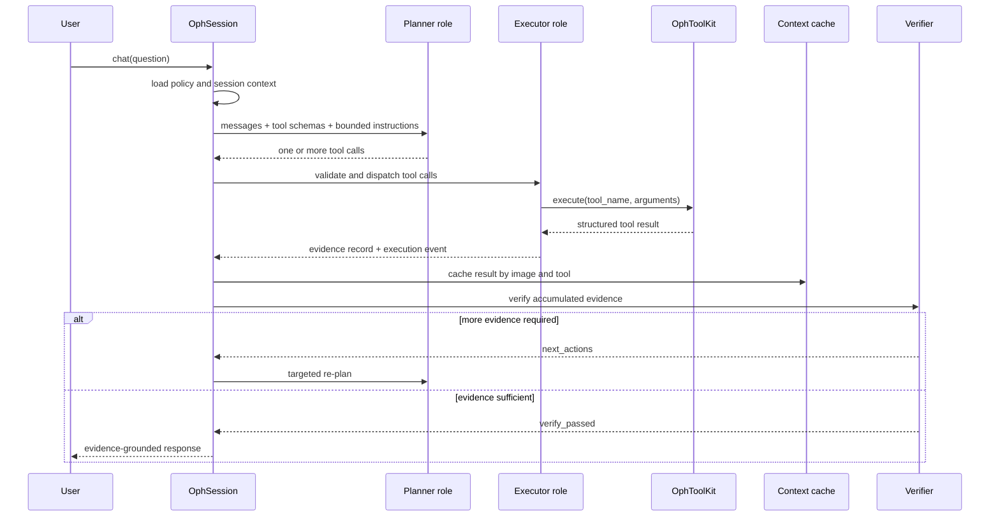

# Chapter 1: The Session Engine

The best place to understand OphAgent is `OphSession`. It is the durable
coordinator for one conversation: it records the selected models, receives
images, retains prior messages, exposes tools to the reasoning model, caches
tool outputs, invokes verification, and saves the resulting state.

Think of `OphSession` as the coordinator of an ophthalmic case conference. It
does not replace the specialist tools. Instead, it keeps the case organised
and decides when another specialist opinion is needed.

## A minimal programmatic session

```python
from ophagent.chat.oph_session import OphSession

session = OphSession.new(
    backend="openai",
    model="gpt-5",
    effort="medium",
)

session.set_image("example_cfp.jpg")
reply = session.chat(
    "Describe the main abnormality and state what additional evidence "
    "would be useful."
)

print(reply)
saved_path = session.save()
print(f"Session saved to: {saved_path}")
```

This example uses real public methods:

1. `OphSession.new(...)` creates a session with a unique identifier.
2. `set_image(...)` validates the file and determines how it may be routed.
3. `chat(...)` runs the bounded planning, execution, and verification loop.
4. `save(...)` serialises the conversation and context as JSON.

The example assumes that the selected provider and required tool resources are
configured. A missing API key or unavailable checkpoint should produce an
explicit error; it should not silently turn into a diagnostic guess.

## What the session stores

`OphSession` separates conversation-level configuration from case-level
context.

| Area | Examples |
|---|---|
| Model configuration | `backend`, `model`, `effort`, optional role-specific models |
| Conversation | `messages`, `created_at`, `last_active`, `owner` |
| Current input | `current_image`, `current_volume`, `current_modality` |
| Multiple inputs | `attached_images` |
| Evidence memory | `analyses`, keyed by image and tool |
| Audit state | `last_run_policy`, `last_report` |

The nested `OphContext` object is where attached images and tool evidence live.
This matters because a conversation can contain several turns and several
modalities without confusing model configuration with clinical evidence.

## One turn under the hood

Calling `session.chat(...)` does more than send text to a model.



The lifecycle is deliberately bounded. `chat()` counts planning rounds,
verification escalations, and repeated tool calls. It can also respond to an
external interrupt from the Web server.

## Multi-turn reuse

Suppose the first turn runs a quality tool, a disease classifier, and a lesion
segmenter. A follow-up question such as:

> Where is the lesion relative to the fovea?

does not automatically rerun all three tools. The session first checks the
evidence stored in `context.analyses`. If the required result is already
available, it can be reused. New tools are called only when the follow-up asks
for evidence that is not yet present.

This is why the session, rather than a single model call, is the correct unit
of interaction.

## Saving and loading

```python
from ophagent.chat.oph_session import OphSession

path = session.save()
restored = OphSession.load(path)

print(restored.session_id)
print(len(restored.messages))
print(restored.context.current_modality)
```

Credentials and active client objects are intentionally excluded from the
saved JSON. A restored session must receive credentials from the runtime
environment or authenticated Web server.

## Source map

| Responsibility | Source path |
|---|---|
| `OphContext` and `OphSession` | `ophagent/chat/oph_session.py` |
| Effort policies | `ophagent/chat/run_policy.py` |
| Tool facade | `ophagent/chat/oph_tools.py` |
| Provider clients | `ophagent/chat/api_config.py` |
| Persistent Web sessions | `ophagent/webchat/server.py` |

## Conclusion

`OphSession` is the stateful boundary around one OphAgent conversation. It
connects inputs, models, tools, evidence, verification, and persistence while
keeping each responsibility explicit.

---

Previous: **[Tutorial index](index.md)**  
Next: **[Chapter 2 - Providers and Model Roles](02_provider_and_model_roles.md)**
