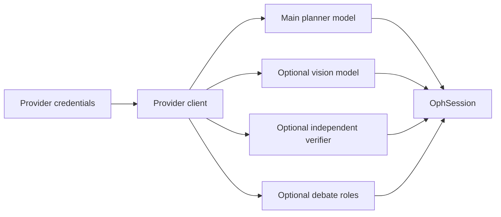

# Chapter 2: Providers and Model Roles

OphAgent separates **where a model is hosted** from **which role that model
performs**. This allows the main tool-calling model, an optional vision model,
and verification roles to use the same provider or different compatible
providers.

The important operational boundary is that credentials are supplied by the
runtime. They are not written into `OphSession` JSON.

## Supported provider interface

The shared provider configuration lives in
`ophagent/chat/api_config.py`. Current provider identifiers include:

| Provider ID | Typical use |
|---|---|
| `openai` | OpenAI API |
| `openrouter` | OpenRouter's OpenAI-compatible endpoint |
| `dashscope` | DashScope's compatible-mode endpoint |
| `aigcbest` | Configured OpenAI-compatible gateway |

`resolve_provider_connection(...)` selects a personal authenticated-user
override when present, otherwise it falls back to environment configuration.
`create_provider_client(...)` then constructs an OpenAI-compatible client.

## Configure a private runtime

Keep credentials, checkpoints, reports, and caches outside the source checkout.

```powershell
New-Item -ItemType Directory -Force "$HOME\ophagent-runtime"
Copy-Item .env.example "$HOME\ophagent-runtime\.env"

$env:OPHAGENT_RUNTIME_DIR = "$HOME\ophagent-runtime"
$env:OPH_WEB_BACKEND = "openai"
$env:OPH_WEB_MODEL = "gpt-5"
$env:OPENAI_API_KEY = "<your-key>"
$env:OPH_WEB_EFFORT = "medium"
```

Do not commit the runtime `.env` file.

## The model roles

An `OphSession` has one primary planner/orchestrator model and optional
role-specific overrides.

| Role | Session fields | Purpose |
|---|---|---|
| Main planner and synthesiser | `backend`, `model` | Reads the conversation, calls tools, and writes the final response |
| Vision fallback | `vision_backend`, `vision_model_override` | Handles visual impressions or modality checks when a separate vision-capable model is needed |
| Independent verifier | `verifier_backend`, `verifier_model` | Reviews raw tool evidence in effort modes that request an independent LLM check |
| Debate verifier | `debate_backend`, `debate_model` | Supports the bounded debate verification mode |

If an override is absent, the role normally falls back to the main session
backend and model.



## Why a separate vision model exists

A tool-capable reasoning model is not necessarily vision-capable. OphAgent
therefore resolves the visual role independently:

1. Use an explicitly configured vision model when available.
2. Otherwise use the main model if it is known to support vision.
3. Otherwise skip vision-only analysis rather than passing an image to a
   text-only endpoint.

For the Web runtime, the relevant optional settings are:

```text
OPH_WEB_VISION_BACKEND
OPH_WEB_VISION_MODEL
```

This separation allows, for example, a text-focused planner to use calibrated
specialist tools while a dedicated multimodal model handles the limited visual
fallback role.

## Per-user Web settings

Authenticated Web UI users can save a provider key and optional compatible
base URL in **Personalize**. The server stores the key beneath the private
runtime directory and never returns the key itself to the browser.

The interface also provides a targeted connection check. Passing this check
means that the provider, authentication, and selected model are reachable. It
does not validate clinical performance.

## Model settings versus execution policy

Model choice and effort policy are related but distinct:

- The model determines how one LLM call interprets the prompt and tool schemas.
- The effort policy determines the allowed planning rounds, verifier mode,
  tool breadth, and escalation budget.

Changing a model must not silently change the provider-independent lifecycle.
Chapter 5 describes these policies in detail.

## A programmatic role configuration

```python
from ophagent.chat.oph_session import OphSession

session = OphSession.new(
    backend="dashscope",
    model="qwen3-vl-plus",
    vision_backend="openai",
    vision_model_override="gpt-5",
    verifier_backend="openai",
    verifier_model="gpt-5",
    effort="high",
)
```

This constructs configuration only. The clients are created lazily when the
corresponding role is first needed.

> [!IMPORTANT]
> A role-specific configuration is useful only when the selected endpoint
> supports the required capability. The Web UI checks that the main model can
> call tools before allowing it to run the analysis pipeline.

## Source map

| Responsibility | Source path |
|---|---|
| Provider specifications and clients | `ophagent/chat/api_config.py` |
| Session role fields and lazy clients | `ophagent/chat/oph_session.py` |
| Web model catalogue | `ophagent/webchat/models_catalog.py` |
| Per-user API settings | `ophagent/webchat/server.py` |
| Environment template | `.env.example` |

## Conclusion

OphAgent treats models as replaceable role backbones while keeping credentials
and lifecycle policy outside the saved clinical session. This makes model
configuration flexible without making the audit trail ambiguous.

---

Previous: **[Chapter 1 - The Session Engine](01_session_engine.md)**  
Next: **[Chapter 3 - Multimodal Input Routing](03_multimodal_input_routing.md)**
