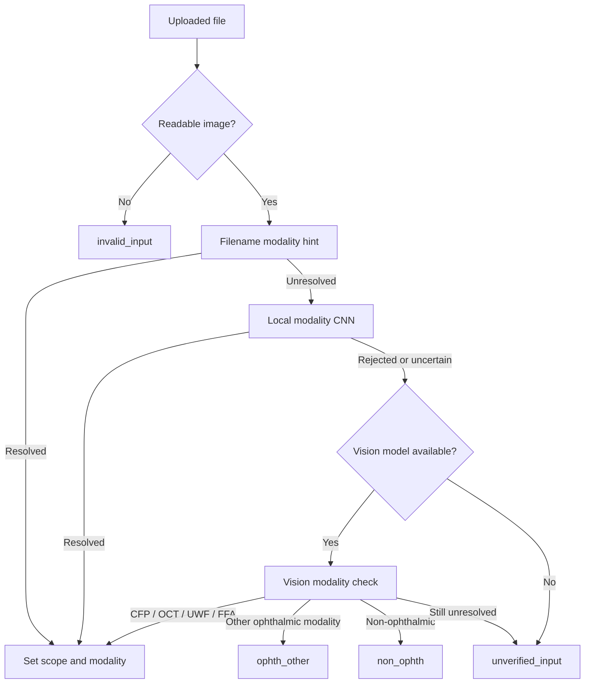
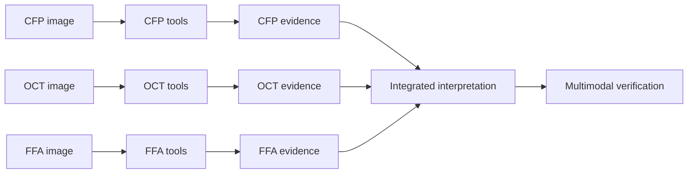

# Chapter 3: Multimodal Input Routing

Before an ophthalmic model can be selected, OphAgent must determine what kind
of input it has received and whether that input is within the supported
clinical scope. Modality routing is therefore a safety prerequisite, not a
cosmetic label.

OphAgent currently provides specialist pipelines for **CFP**, **OCT**,
**UWF**, and **FFA**, together with selected paired-modality and OCT-volume
tools.

Use only a publication-cleared, de-identified, or approved public example when
following the image-routing examples below. Clinical inputs belong in the
private runtime and must not be committed to the source repository.

## Registering an image

```python
from ophagent.chat.oph_session import OphSession

session = OphSession.new(
    backend="openai",
    model="gpt-5",
    effort="medium",
)

session.set_image("example_cfp.jpg")
print(session.context.current_modality)
print(session.context.modality_scope)
```

`set_image(...)` first verifies that the path resolves to a readable image and
that its dimensions fall within the configured safety limit. It then applies
a routing ladder.



The routing ladder deliberately avoids forcing an uncertain input into the
nearest-looking specialist pipeline.

## Scope states

`OphContext.modality_scope` records the resulting branch.

| Scope | Meaning | Chat behaviour |
|---|---|---|
| `in_scope` | Supported CFP, OCT, UWF, or FFA input | Run the planner-executor-verifier pipeline |
| `ophth_other` | Ophthalmic but unsupported specialist modality, such as a visual field or OCT-A input | Use a constrained vision-only response when available |
| `non_ophth` | Input is not ophthalmic | Return a structured refusal |
| `unverified_input` | Ophthalmic scope could not be established | Refuse diagnostic tool routing |
| `invalid_input` | File is missing, unreadable, or fails validation | Return an invalid-input response |

These branches are checked at the beginning of `OphSession.chat(...)`, before
the normal tool loop begins.

## Multiple images in one session

Every accepted image is appended to `context.attached_images` with its path,
modality, filename, and upload time. Reattaching the same path updates the
existing entry rather than creating a second copy.

```python
session.set_image("right_eye_cfp.jpg")
session.set_image("right_eye_oct.jpg")

for item in session.context.attached_images:
    print(item["modality"], item["filename"])

reply = session.chat(
    "Integrate the colour fundus and OCT findings, preserving the evidence "
    "from each modality."
)
```

OphAgent enters multimodal mode only when at least two distinct supported
modalities are attached. Two CFP images remain a single-modality session.

## Modality-specific versus integrated evidence

The session first gathers evidence from tools appropriate to each modality.
Only then should an integrated conclusion be formed.



The multimodal completion guard checks whether every attached supported
modality has core evidence. If one modality is missing evidence, the session
can request a repair step instead of presenting a partially grounded
integration as complete.

## OCT volumes

Volumes are registered separately:

```python
session.set_volume("path/to/oct_volume_or_series")
print(session.context.current_volume)
```

Volume-level adapters can accept a DICOM series or supported volume structure.
Their outputs should preserve links to representative slices or derived
figures so a volume summary can be checked against the underlying scan.

## Evidence cache keys

Web-facing model paths may be relative while server paths are absolute.
OphAgent canonicalises these forms through the session's analysis key before
using a path as a cache key. This prevents one image from accidentally
acquiring two evidence histories.

Conceptually:

```text
context.analyses = {
    "<canonical image path>": {
        "cfp_eyeq": { ... },
        "cfp_clip_ensemble": { ... },
        "cfp_retsam_segmentation": { ... }
    }
}
```

## Source map

| Responsibility | Source path |
|---|---|
| Image validation and scope routing | `ophagent/chat/oph_session.py` |
| Filename, CNN, and vision modality checks | `ophagent/chat/oph_tools.py` |
| OCT-volume adapters | `ophagent/adapters/oct_volume/` |
| Multimodal completion guards | `ophagent/chat/oph_session.py` |
| Upload endpoint | `ophagent/webchat/server.py` |

## Conclusion

Input routing establishes three things before diagnosis: whether the input is
valid, whether it is ophthalmic, and whether OphAgent has a supported
specialist pipeline for it. Multimodal reasoning then builds on separate,
traceable modality-specific evidence.

---

Previous: **[Chapter 2 - Providers and Model Roles](02_provider_and_model_roles.md)**  
Next: **[Chapter 4 - Tool Registry and Adapters](04_tool_registry_and_adapters.md)**
