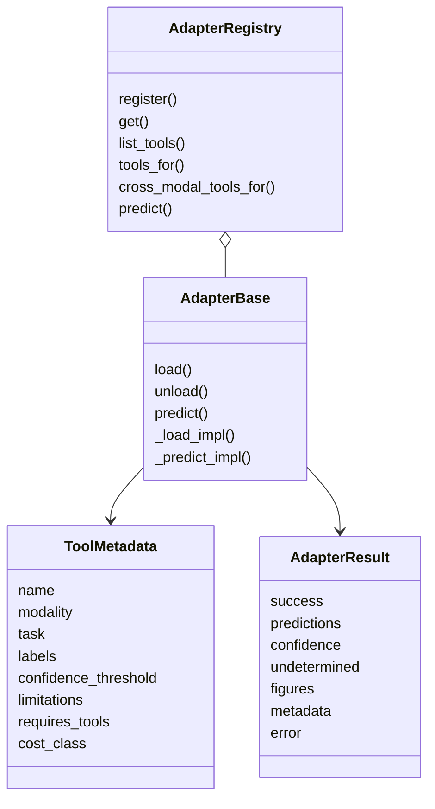
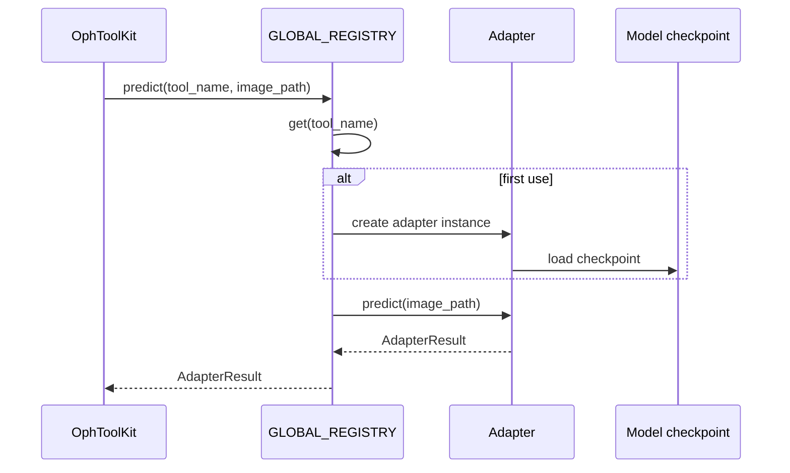

# Chapter 4: Tool Registry and Adapters

OphAgent integrates models trained by different teams, with different
dependencies, input sizes, label spaces, and output formats. The adapter layer
turns these heterogeneous models into a common tool interface.

The central idea is simple:

> A planner should not need to know how a checkpoint is loaded. It should know
> what the tool does, what modality it accepts, what evidence it returns, and
> what limitations apply.

## The four adapter building blocks

The common interface is defined in `ophagent/adapters/base.py`.

| Component | Responsibility |
|---|---|
| `ToolMetadata` | Describes the tool's name, modality, task, labels, confidence threshold, dependencies, cost, and limitations |
| `AdapterResult` | Carries standardised predictions, confidence, uncertainty, figures, metadata, and errors |
| `AdapterBase` | Defines lazy loading and prediction lifecycle |
| `AdapterRegistry` | Registers adapter classes and creates one cached instance per tool |

All imported adapters register with the process-wide `GLOBAL_REGISTRY`.



## Inspect the registry without running inference

Importing `ophagent.adapters` imports the modality packages and triggers their
`@register` decorators. Model weights remain lazy and are not loaded merely by
listing metadata.

```python
from ophagent.adapters import GLOBAL_REGISTRY

for tool in GLOBAL_REGISTRY.list_tools():
    print(
        f"{tool.name:32s} "
        f"{tool.modality:8s} "
        f"{tool.task:16s} "
        f"{tool.cost_class}"
    )
```

Filter by modality:

```python
cfp_tools = GLOBAL_REGISTRY.list_tools(modality="CFP")
for tool in cfp_tools:
    print(tool.name, tool.description)
```

On Windows, use UTF-8 mode if the terminal cannot print Unicode-rich metadata:

```powershell
python -X utf8 -c "from ophagent.adapters import GLOBAL_REGISTRY; print([x.name for x in GLOBAL_REGISTRY.list_tools()])"
```

## Lazy model loading

`AdapterRegistry.get(...)` creates an adapter instance only when that tool is
needed. `AdapterBase.predict(...)` then calls `load()` on first use.



Loading is serialised across threads. This avoids races in lazy imports and
simultaneous allocation of several large checkpoints. Once loaded, inference
is not globally serialised by that loading lock.

## Standardising uncertainty

Every tool has a `confidence_threshold`. After `_predict_impl(...)` returns,
`AdapterBase.predict(...)` marks the result as `undetermined=True` when the
primary confidence falls below that threshold.

A successful `AdapterResult` can therefore be technically valid while still
being clinically uncertain:

```python
{
    "success": True,
    "tool": "example_tool",
    "modality": "CFP",
    "task": "classification",
    "predictions": {"top_label": "example finding"},
    "confidence": 0.43,
    "undetermined": True,
    "figures": {},
    "metadata": {},
    "error": None,
}
```

The planner and verifier are instructed not to promote an undetermined result
into a definitive conclusion.

## Fail locally, not globally

Several modality packages contain optional or heavy dependencies. Their
imports are isolated so one unavailable external model does not make every
other modality unusable.

At inference time, adapter exceptions are converted into an unsuccessful
`AdapterResult` containing the tool name and error. This gives the session a
structured failure that can be reported and audited.

## Tool selection metadata

The registry provides more than alphabetical listing:

- `tools_for(modality, task)` returns compatible tools in a curated
  preferred-use order.
- `cross_modal_tools_for(modalities)` returns paired-modality tools whose input
  requirements are satisfied.
- `requires_tools` records explicit dependencies.
- `cost_class` helps describe expected execution burden.
- `limitations` gives the planner and verifier known failure modes.

This metadata lets the orchestration layer reason about capabilities without
importing model-specific implementation details.

## Current adapter families

| Family | Directory |
|---|---|
| CFP classification, quality, segmentation, and disease workups | `ophagent/adapters/cfp/` |
| OCT classification, fluid/layer segmentation, and quality | `ophagent/adapters/oct/` |
| UWF classification and vessel segmentation | `ophagent/adapters/uwf/` |
| FFA classification and lesion detection | `ophagent/adapters/ffa/` |
| Paired CFP/OCT or CFP/FFA analysis and reporting | `ophagent/adapters/paired/` |
| OCT volume-level analysis | `ophagent/adapters/oct_volume/` |

## Source map

| Responsibility | Source path |
|---|---|
| Base classes and registry | `ophagent/adapters/base.py` |
| Registration-by-import | `ophagent/adapters/__init__.py` |
| Modality imports | `ophagent/adapters/<modality>/__init__.py` |
| Tool schema wrapper | `ophagent/chat/oph_tools.py` |
| Tool-resource enable/disable state | `ophagent/checkpoint_config.py` |

## Conclusion

The adapter layer is the boundary between heterogeneous ophthalmic models and
the shared agent workflow. It makes model behaviour inspectable through
metadata and results while retaining model-specific loading and inference
inside each adapter.

---

Previous: **[Chapter 3 - Multimodal Input Routing](03_multimodal_input_routing.md)**  
Next: **[Chapter 5 - Planning and Effort Policies](05_planning_and_effort_policies.md)**
