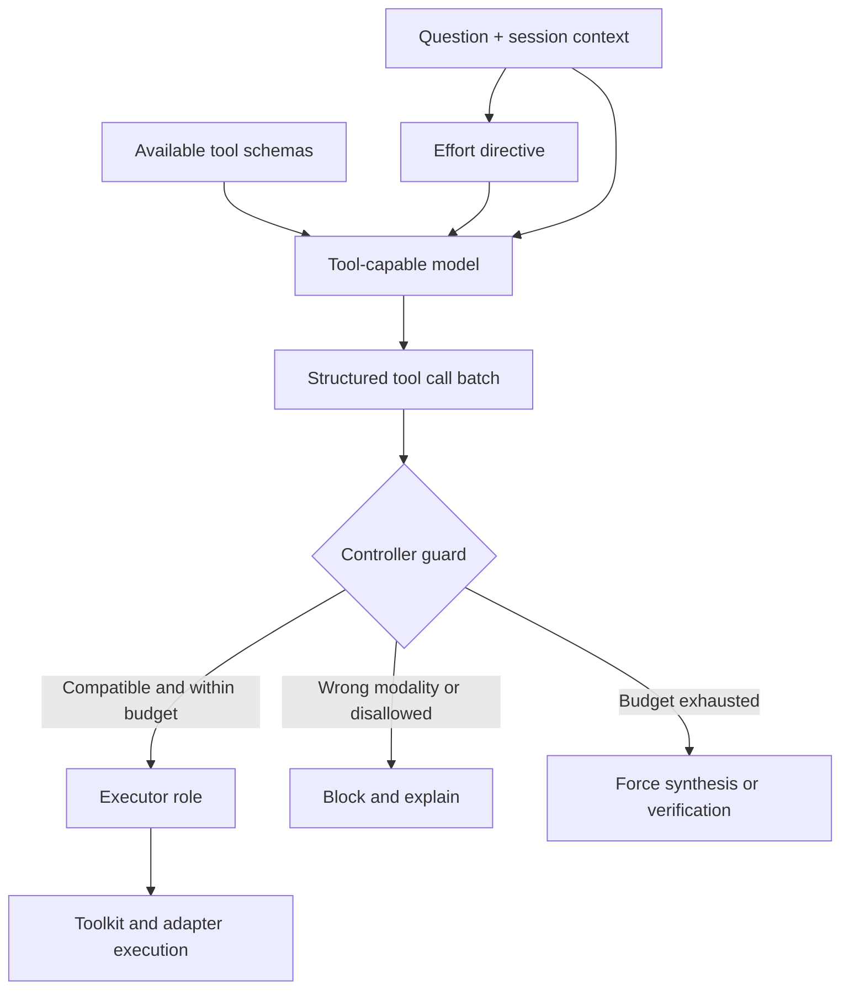

# Chapter 5: Planning and Effort Policies

The planner in OphAgent is an **orchestration role**, not a separate
`Planner` Python class. Inside `OphSession.chat(...)`, the main tool-capable
model receives the conversation, bounded policy instructions, and compatible
tool schemas. Its structured tool calls form the plan.

This distinction matters because planning has two layers:

1. The model decides which allowed action is useful for the current question.
2. Deterministic controller policy limits how many planning and verification
   rounds may occur and which verifier mode is required.

The language model proposes actions; it does not own the lifecycle.

## From schemas to a plan

`OphToolKit.get_all_schemas()` exposes registered tools in an OpenAI-compatible
function-calling format. The session adds:

- the conversation history;
- current image and modality context;
- supported and unsupported task information;
- an effort-specific directive;
- tool schemas permitted by the selected prompt profile;
- controller-enforced stopping and verification rules.

The model can then emit one or more tool calls in a planning round.



## Effort policies

`ophagent/chat/run_policy.py` is the source of truth for provider-independent
execution policies.

| Effort | Planning rounds | Verification escalations | Verifier mode | Vision mode | Final verifier | Tool breadth |
|---|---:|---:|---|---|---|---|
| `low` | 1 | 0 | controller rule | disabled | no | one preferred compatible tool |
| `medium` | 2 | 1 | structured rule | targeted | yes | up to two compatible tools |
| `high` | 3 | 1 | independent LLM | targeted | yes | up to three compatible tools |
| `max` | 4 | 2 | bounded debate | targeted | yes | up to four compatible tools |
| `ultra` | 5 | 2 | bounded debate | exhaustive | yes | all compatible tools |

These rows are execution configurations. They are not a claim that calling
more tools always improves the clinical answer.

Inspect a policy directly:

```python
from ophagent.chat.run_policy import get_effort_policy

policy = get_effort_policy("high")
print(policy.to_dict())
```

## Planning rounds versus tool count

A planning round can contain parallel tool calls. Consequently:

- `plan_rounds=2` does not mean that only two tools may run;
- a composite tool may call or combine several underlying models;
- a multimodal case may receive a higher minimum round budget so each attached
  modality can obtain core evidence;
- verification escalation has a separate budget from initial planning.

This separation prevents the planner from consuming the entire lifecycle
budget before a requested verification repair can occur.

## Tool compatibility is enforced twice

The planner receives a feasibility description so it can avoid irrelevant
calls. The controller also applies code-level checks:

1. **Instruction-level routing:** tell the model which tools match the current
   modality and task.
2. **Execution-level guard:** block a mismatched call even if the model still
   requests it.

This is particularly important when schemas from several modalities are
visible in one session.

## Fresh-image evidence requirement

For a newly attached in-scope image with no cached analyses, the session forces
the first action into the tool pipeline. A direct image diagnosis from the
general reasoning model is not accepted as a replacement for calibrated tool
evidence.

Follow-up turns are different: if the session already has structured evidence,
the planner may reuse it.

## Prompt profiles

The default `standard` profile preserves the full interactive experience.
Focused profiles can reduce unrelated prompt and tool-schema context for
specific evaluation settings.

The profile changes the prompt and visible schemas; it does not bypass the
session's modality, evidence, loop, or verification guards.

```python
from ophagent.chat.oph_session import OphSession

standard = OphSession.new(prompt_profile="standard")
focused = OphSession.new(prompt_profile="compact-mac")
```

Focused profiles are opt-in and should be named explicitly in a reproducible
evaluation.

## Why the controller is necessary

Without a controller, a tool-capable model could:

- repeatedly call the same tool;
- request a tool for the wrong modality;
- stop before collecting core evidence;
- continue opening new planning rounds after sufficient evidence exists;
- ignore a verifier's targeted next action;
- produce a final response after evidence changed but before re-verification.

`OphSession.chat(...)` tracks these states independently of the model's prose.

## Source map

| Responsibility | Source path |
|---|---|
| Tool-calling planner loop | `ophagent/chat/oph_session.py` |
| Deterministic effort policy | `ophagent/chat/run_policy.py` |
| Prompt and schema profiles | `ophagent/chat/prompt_profiles.py` |
| Tool schemas | `ophagent/chat/oph_tools.py` |
| Model capability catalogue | `ophagent/webchat/models_catalog.py` |

## Conclusion

OphAgent combines model-driven planning with deterministic lifecycle control.
The model chooses among allowed actions; the session decides how long the
process may continue, what evidence is mandatory, and when verification is
required.

---

Previous: **[Chapter 4 - Tool Registry and Adapters](04_tool_registry_and_adapters.md)**  
Next: **[Chapter 6 - The Executor](06_executor_and_evidence.md)**
