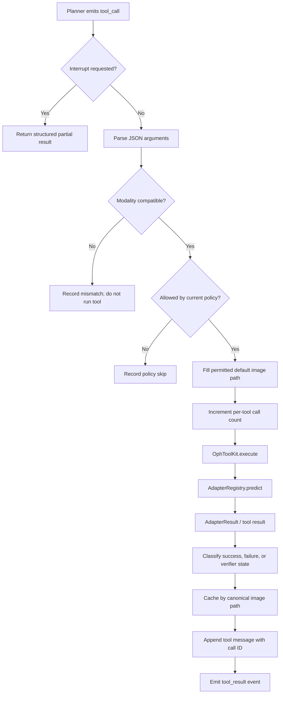
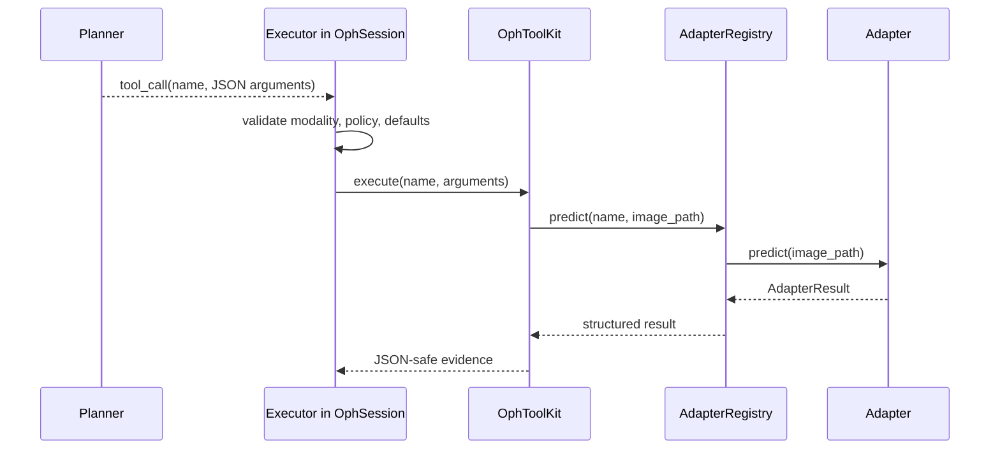

# Chapter 6: The Executor

The Planner decides **what action to request**. The Executor makes that request
safe, concrete, observable, and persistent.

In OphAgent's main multimodal runtime, the Executor is an architectural role
rather than one standalone `Executor` class. Its implementation is distributed
across three cooperating layers:

1. `OphSession.chat(...)` validates and dispatches model-generated tool calls.
2. `OphToolKit.execute(...)` resolves a tool name and invokes its function.
3. `AdapterRegistry.predict(...)` obtains the lazy-loaded adapter and runs
   model inference.

This is the effective Executor path used by the conversational Web UI.

## Planner and Executor are different responsibilities

The Planner receives the question, context, policy, and tool schemas. It may
return a structured tool call such as:

```json
{
  "id": "call_01",
  "type": "function",
  "function": {
    "name": "cfp_eyeq",
    "arguments": "{\"image_path\":\"right_eye.jpg\"}"
  }
}
```

The Planner has proposed an action. Nothing has run yet.

The Executor must now:

- parse the arguments;
- honour interruption;
- reject a modality mismatch;
- apply policy skips and post-verification closure;
- fill a permitted default image path when omitted;
- count repeated calls;
- invoke the toolkit;
- catch malformed arguments and runtime failures;
- measure elapsed time;
- classify the outcome as successful, failed, or skipped;
- cache the result under the correct image and tool;
- append a tool message with the matching `tool_call_id`;
- emit a structured event for the Web UI.

These operations are deterministic controller behaviour, not additional model
reasoning.

## The complete dispatch path



## Step 1: Preserve the model's proposed call

When the model response contains `tool_calls`, `OphSession.chat(...)` first
stores the assistant record, including each call's ID, name, and raw argument
string. This preserves what the Planner requested before execution changes or
normalises anything.

If a later interruption prevents one call from running, the session backfills
the required tool response records so the saved conversation remains valid for
the next model request.

## Step 2: Parse and validate arguments

Tool-call arguments arrive as JSON text:

```python
try:
    args = json.loads(tool_call.function.arguments or "{}")
except json.JSONDecodeError:
    args = {}
```

The Executor then checks modality compatibility in code. A CFP tool requested
for a UWF image is recorded as a mismatch and is not executed.

This check remains necessary even though the Planner has already received
modality guidance. Prompt instructions reduce bad requests; the Executor guard
prevents them from reaching a model.

## Step 3: Resolve defaults without inventing parameters

Models sometimes omit `image_path`. OphAgent fills the current image only when
the selected tool's declared schema actually contains an `image_path`
parameter.

This avoids blindly passing image arguments to tools such as sandboxed
computation or verification that may have a different contract.

## Step 4: Apply execution policy

Before dispatch, the Executor checks whether the requested tool should run
under the current lifecycle state. Examples include:

- a tool excluded by the selected execution policy;
- unnecessary calls after the final verifier closed evidence collection;
- a tool not authorised by the verifier's `next_actions`;
- a repeated tool caught by the loop-protection counter.

A policy skip is retained as a structured result. It is not reported as model
inference.

## Step 5: Dispatch through the toolkit

The central call is conceptually small:

```python
result = session._toolkit.execute(tool_name, **args)
```

`OphToolKit` resolves the registered function. For an adapter-backed tool, that
function delegates to:

```python
GLOBAL_REGISTRY.predict(tool_name, image_path, **adapter_arguments)
```

The registry creates or reuses the adapter instance, `AdapterBase.predict(...)`
loads weights on first use, and `_predict_impl(...)` performs model-specific
inference.



A model response can contain several tool calls in one planning batch.
`OphSession` dispatches the calls through this guarded loop and preserves a
separate result for each call.

## Step 6: Classify the outcome

The Executor records a tool as failed when the result contains a top-level
error or explicitly reports `success=False`. A policy skip receives its own
state.

Verifier calls receive an additional validity check. A verifier response must
be machine-readable, contain a Boolean `verify_passed`, and cannot claim a
normal pass from zero reviewed tools.

The outcome state feeds the later evidence-sufficiency gate.

## Step 7: Capture evidence and provenance

The result is cached under a canonical input key:

```python
session.context.analyses = {
    "<canonical image path>": {
        "cfp_eyeq": { ... },
        "cfp_clip_ensemble": { ... }
    }
}
```

The session also appends a `role="tool"` message containing:

- the original `tool_call_id`;
- the tool name;
- a JSON-safe result prepared for the active prompt profile.

Exact call-ID pairing matters when a Planner emits several calls and their
results later appear in an exported trace.

## Step 8: Emit observable execution events

The Executor emits events including:

```text
tool_call:
  name
  arguments

tool_result:
  name
  preview
  elapsed_s
  structured result
  predictions or error
  optional figure URLs
```

The Web UI uses these events to show progress and tool-level detail while the
session runs. The same structured result remains available for verification
and export.

## Evidence memory and follow-up reuse

The Executor's cache serves three purposes:

- **Efficiency:** unchanged tool results can support later questions without
  unnecessary recomputation.
- **Consistency:** follow-up reasoning uses the same evidence record.
- **Traceability:** verification and export can recover the exact tool result
  supporting a response.

New tools still run when a follow-up asks for evidence that is not present.
The cache is session context, not a longitudinal clinical database.

## Executor failure boundaries

| Condition | Executor behaviour |
|---|---|
| Invalid JSON arguments | Use an empty object, then allow schema validation or a structured error |
| Missing required argument | Return a typed argument error with a repair hint |
| Wrong modality | Do not run the tool; record the mismatch |
| Disabled or policy-closed tool | Record a policy skip |
| Adapter load or inference failure | Preserve a structured error |
| User interruption | Stop before the next dispatch and preserve valid history |
| Same tool called repeatedly | Trigger bounded loop protection |

The final synthesiser cannot convert these failures into successful evidence.

## Source map

| Executor responsibility | Source path |
|---|---|
| Tool-call parsing, guards, dispatch, timing, cache, and events | `ophagent/chat/oph_session.py` |
| Tool name and schema resolution | `ophagent/chat/oph_tools.py` |
| Adapter lookup and prediction | `ophagent/adapters/base.py` |
| Tool schema datatype reused by the toolkit | `ophagent/agent/tools/oct_tools.py` |
| Streamed browser events | `ophagent/webchat/server.py` |
| Exported call-ID/result pairing | `ophagent/webchat/export.py` |

## Conclusion

The Executor is the controlled boundary between a model's proposed tool call
and a durable evidence record. It prevents inappropriate calls, runs the
selected capability, captures provenance, and makes the result available to
the Planner, Verifier, Web UI, and export pipeline.

---

Previous: **[Chapter 5 - Planning and Effort Policies](05_planning_and_effort_policies.md)**  
Next: **[Chapter 7 - Verification and Safe Stopping](07_verification_and_safe_stopping.md)**
