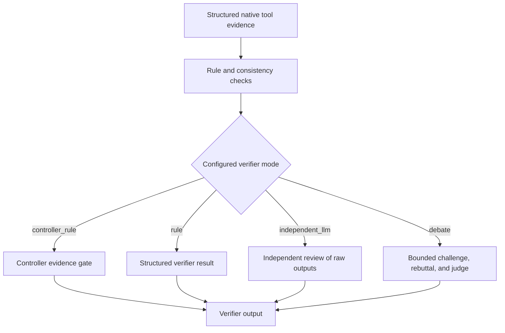
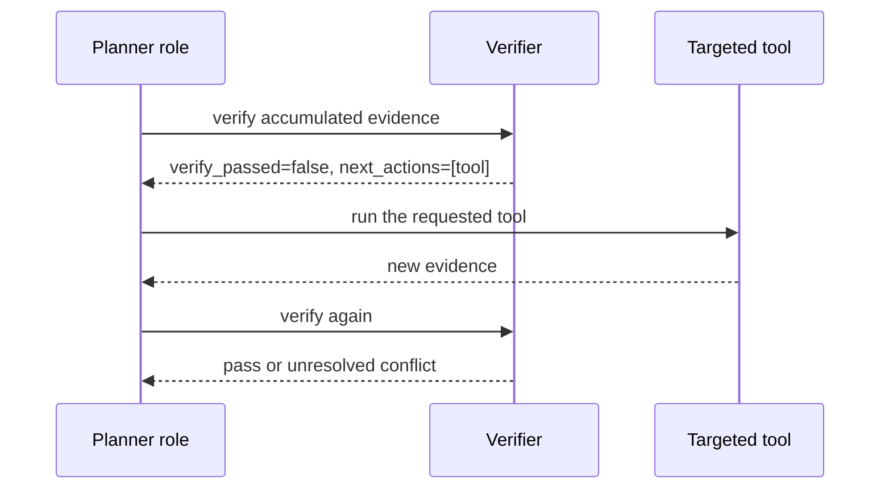

# Chapter 7: Verification and Safe Stopping

OphAgent's verifier checks whether the accumulated tool evidence is sufficient
and internally coherent for the type of response being prepared. It can expose
conflict, request one targeted follow-up action, or require the final response
to remain uncertain.

Verification is a safety and traceability layer. It is not proof that a
clinical conclusion is correct.

## The verifier input

The `verify_findings` tool accepts an optional JSON object:

```json
{
  "tools_run": [
    "cfp_eyeq",
    "cfp_clip_ensemble"
  ],
  "results": [
    {
      "tool": "cfp_eyeq",
      "predictions": {
        "quality": "Usable"
      },
      "confidence": 0.91,
      "undetermined": false
    },
    {
      "tool": "cfp_clip_ensemble",
      "predictions": {
        "top_label": "example finding"
      },
      "confidence": 0.84,
      "undetermined": false
    }
  ]
}
```

If the model omits the argument, passes an empty string, or passes a
semantically empty object such as `{}`, the verifier reconstructs the findings
from the session's cached tool results.

An empty cache does not become a successful verification. A completed
machine-readable verifier result is valid only when it has an explicit
`verify_passed` Boolean and, when `n_tools_run` is present, that count is
greater than zero.

## The verifier output

A normal result contains fields such as:

| Field | Meaning |
|---|---|
| `status` | Whether the verifier completed in a machine-readable way |
| `input_source` | `provided` or reconstructed from `session_cache` |
| `n_tools_run` | Number of structured evidence records reviewed |
| `issues` | Conditions that prevent a normal pass |
| `warnings` | Quality, confidence, diagnostic conflict, or other cautions |
| `warning_categories` | Warnings separated by their type |
| `diagnostic_votes` | Canonical disease-family evidence |
| `verify_passed` | Whether the current evidence satisfies the configured check |
| `next_actions` | Targeted evidence requests before finalisation |
| `recommendation` | Guidance for synthesis or escalation |
| `independent_review` | Optional independent LLM review |
| `debate_review` | Optional bounded debate result |

The exact optional fields depend on the effort policy and available model
roles.

## Verification modes



Independent and debate reviewers receive raw tool outputs rather than the
planner's private reasoning. This reduces the chance that verification merely
rephrases the planner's preferred conclusion.

## What the verifier checks

The structured verifier examines several distinct questions:

1. **Evidence availability:** did any structured clinical tool complete?
2. **Quality:** did a quality model reject or limit the image?
3. **Confidence:** are key results below their configured thresholds?
4. **Diagnostic agreement:** do independent tools support compatible disease
   families?
5. **Core evidence:** did the current modality obtain the evidence required
   for finalisation?
6. **Multimodal coverage:** did every attached supported modality contribute
   core evidence?
7. **Freshness:** was new evidence added after the last verification?

A quality warning and a disease-level conflict are not interchangeable. The
final report should preserve each warning at the level where it arose.

## Targeted escalation

When a single additional tool can resolve a meaningful conflict, the verifier
may return `next_actions`.



Verification escalation has its own bounded budget. If the budget is exhausted
and disease-level conflict remains, the system should report an uncertain
differential and recommend confirmatory assessment rather than force a single
high-confidence label.

## Safe stopping states

| State | Appropriate response |
|---|---|
| Evidence sufficient and internally consistent | Finalise while preserving any local quality or confidence cautions |
| Targeted next action available | Run the action and re-verify |
| New evidence added after verification | Treat the old verifier result as stale |
| Core evidence missing | Return an insufficient-data response |
| Conflict remains after bounded escalation | Report uncertainty and recommended follow-up |
| Tool failure | Report the failure explicitly |
| User interrupt | Return the completed evidence without pretending the run finished normally |

## Verification does not replace clinical review

A verifier can detect disagreement among the evidence it receives. It cannot:

- recover clinical history that was never provided;
- guarantee that every tool was trained for the current population;
- correct a shared bias across all underlying models;
- establish a diagnosis beyond the supported input and task scope;
- replace examination or clinician responsibility.

Its value is that these boundaries and evidence states become inspectable.

## Source map

| Responsibility | Source path |
|---|---|
| `verify_findings` implementation | `ophagent/chat/oph_tools.py` |
| Verifier validity and freshness guards | `ophagent/chat/oph_session.py` |
| Effort-to-verifier mapping | `ophagent/chat/run_policy.py` |
| Verifier prompts and role clients | `ophagent/chat/oph_session.py` |
| Regression tests | `tests/test_cfp_hemorrhage_etiology_guard.py` |

## Conclusion

Verification determines whether a response is adequately grounded under the
configured policy. It supports safe stopping by distinguishing a normal pass,
a repairable evidence gap, and an unresolved condition that must remain
uncertain.

---

Previous: **[Chapter 6 - The Executor](06_executor_and_evidence.md)**  
Next: **[Chapter 8 - Web UI and Exports](08_web_ui_and_exports.md)**
