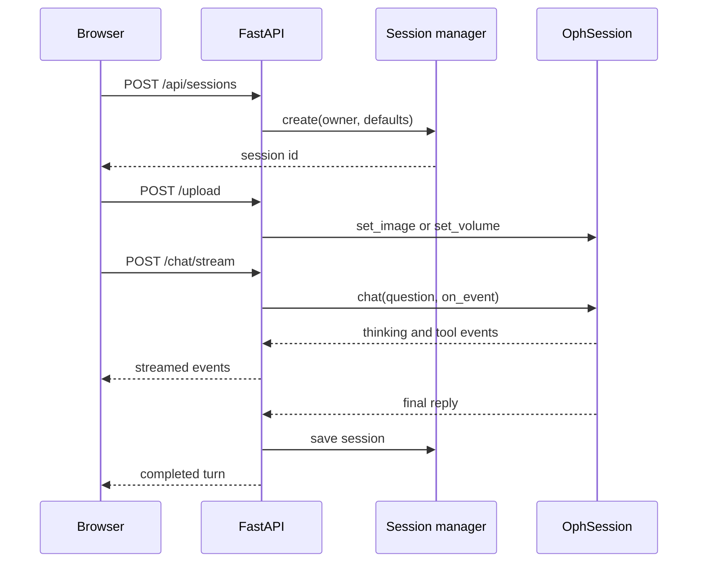
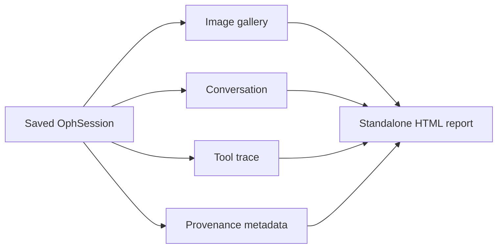

# Chapter 8: Web UI and Exports

The OphAgent Web UI turns the session engine into a multi-user conversational
service. FastAPI routes manage sessions, uploads, model settings, streamed tool
events, interruption, and report export while keeping server-side credentials
and filesystem paths out of browser responses.

## Start the Web service

After installing the package and configuring the private runtime:

```powershell
$env:OPHAGENT_RUNTIME_DIR = "$HOME\ophagent-runtime"
$env:OPH_WEB_HOST = "127.0.0.1"
$env:OPH_WEB_PORT = "8765"

ophagent-web
```

Then open:

```text
http://127.0.0.1:8765/
```

The lightweight development entry point below starts the same server:

```powershell
python demos/webchat.py
```

## Main API surface

| Method and path | Purpose |
|---|---|
| `POST /api/sessions` | Create a session |
| `GET /api/sessions` | List sessions visible to the authenticated user |
| `GET /api/sessions/{sid}` | Load messages, context, and display metadata |
| `DELETE /api/sessions/{sid}` | Delete a session |
| `POST /api/sessions/{sid}/upload` | Attach an image or supported volume |
| `POST /api/sessions/{sid}/model` | Change provider, model, or effort |
| `POST /api/sessions/{sid}/chat` | Run a synchronous chat turn |
| `POST /api/sessions/{sid}/chat/stream` | Stream thinking and tool events |
| `POST /api/sessions/{sid}/abort` | Request interruption |
| `GET /api/sessions/{sid}/export` | Export a self-contained report |
| `GET /api/catalog` | Return model and provider choices |
| `GET/POST /api/settings/api/...` | Manage and check personal provider settings |
| `GET/POST /api/settings/checkpoints/...` | Manage administrator tool resources |

## A browser turn



The server acquires a per-session run lock before model changes or chat. This
prevents two overlapping requests from mutating one conversation
simultaneously.

## Per-user session isolation

An authenticated identity is stored as the session owner. Session listing,
loading, mutation, deletion, and export are checked against that identity.

The service supports:

- local trusted mode for loopback-only development;
- Basic Auth when `WEB_USERNAME` and `WEB_PASSWORD` are configured;
- optional Cloudflare Access identity with Basic Auth fallback.

The server refuses to bind to a public interface when authentication is not
configured. Public deployment also requires the institution's normal network,
privacy, and clinical-data governance controls.

## Personal provider settings

The **Personalize** panel can:

- select a provider and compatible model;
- store a user's own API key server-side;
- set an optional compatible base URL with that personal key;
- check one provider or model configuration;
- remember the user's last provider, model, and effort choice.

The API returns status and source information, never the API-key value.

Administrator-only tool settings can enable or disable model resources and
check configured checkpoint or source paths. Large model resources remain
outside the release checkout.

## Live tool events and interruption

The streaming route passes an `on_event` callback into `OphSession.chat(...)`.
The interface can therefore show tool calls and results while a turn runs.

When the user presses stop, `/api/sessions/{sid}/abort` sets the session's
interrupt flag. The loop checks the flag before another model call and returns
a structured partial response based on completed evidence.

## Self-contained export

`build_session_html(...)` creates a standalone HTML report containing:

- attached-image gallery when files are available;
- user questions and OphAgent responses;
- ordered tool-call trace with result previews;
- linked or inlined generated figures;
- session and generation metadata.

Tool results are attached to their exact tool-call identifiers so parallel or
interleaved calls do not corrupt the exported trace.



The export is a review artifact. It should not expose API keys or unrestricted
server filesystem paths.

## Operational checks

Before treating a local deployment as equivalent to a complete evaluation
environment:

```powershell
ophagent-preflight
```

The preflight path checks provider configuration, imports, adapter
registration, configured resources, and modality coverage. Passing a software
check does not establish clinical validity for a new population or workflow.

## Source map

| Responsibility | Source path |
|---|---|
| FastAPI routes and authentication | `ophagent/webchat/server.py` |
| Frontend assets | `ophagent/webchat/static/` |
| Model catalogue | `ophagent/webchat/models_catalog.py` |
| Standalone HTML export | `ophagent/webchat/export.py` |
| Web entry point | `demos/webchat.py` |
| Deployment checks | `ophagent/preflight.py` |

## Conclusion

The Web layer is a controlled interface around `OphSession`. It adds user
ownership, concurrent-run protection, private configuration, streaming,
interruption, and export without moving clinical orchestration into the
browser.

---

Previous: **[Chapter 7 - Verification and Safe Stopping](07_verification_and_safe_stopping.md)**  
Next: **[Chapter 9 - Extending OphAgent](09_extending_ophagent.md)**
