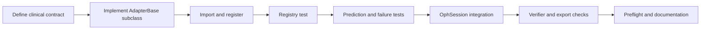

# Chapter 9: Extending OphAgent

New ophthalmic models enter OphAgent through the adapter layer. A correctly
implemented adapter gives the existing session, planner, executor, cache,
verifier, Web UI, and export path a new tool without adding model-specific
logic to the central loop.

This chapter shows the required integration points.

## Step 1: Define the clinical contract

Before writing code, define:

- supported modality;
- clinical task;
- required input and preprocessing;
- output labels or quantitative fields;
- confidence definition and threshold;
- known failure modes;
- required upstream tools;
- expected runtime cost;
- generated figures or masks.

These are part of `ToolMetadata`, not optional documentation.

## Step 2: Create an adapter

The following is a skeleton. Replace the placeholder model loading and
inference with the real implementation.

```python
from pathlib import Path

from ophagent.adapters.base import (
    AdapterBase,
    AdapterResult,
    ToolMetadata,
    register,
)


@register
class ExampleCFPAdapter(AdapterBase):
    metadata = ToolMetadata(
        name="cfp_example_classifier",
        modality="CFP",
        task="classification",
        description=(
            "Classifies a CFP image for the example endpoint and returns "
            "calibrated class probabilities."
        ),
        input_size=(224, 224),
        labels=["negative", "positive"],
        confidence_threshold=0.60,
        limitations=[
            "Validated only on standard-field colour fundus photographs",
            "Do not use on UWF or FFA images",
        ],
        requires_tools=[],
        cost_class="fast",
    )

    def _load_impl(self) -> None:
        checkpoint = Path("/private/runtime/checkpoints/example/model.pt")
        if not checkpoint.exists():
            raise FileNotFoundError(f"Missing checkpoint: {checkpoint}")

        # Load the real model here.
        self._impl = load_example_model(checkpoint, device=self.device)

    def _predict_impl(self, image_path: str, **kwargs) -> AdapterResult:
        probabilities = run_example_inference(
            self._impl,
            image_path,
            device=self.device,
        )
        top_label = max(probabilities, key=probabilities.get)
        confidence = float(probabilities[top_label])

        return AdapterResult(
            success=True,
            tool=self.metadata.name,
            modality=self.metadata.modality,
            task=self.metadata.task,
            predictions={
                "top_label": top_label,
                "probabilities": probabilities,
            },
            confidence=confidence,
            metadata={
                "checkpoint_version": "example-v1",
            },
        )
```

Do not catch every exception inside `_predict_impl(...)`. `AdapterBase.predict`
already converts an unexpected failure into a structured unsuccessful
`AdapterResult`.

## Step 3: Import the module

Registration occurs when Python imports the module containing `@register`.
Add the new module to the appropriate modality package:

```python
# ophagent/adapters/cfp/__init__.py
from . import example_classifier  # noqa: F401
```

For a genuinely optional dependency, isolate that import:

```python
try:
    from . import example_classifier  # noqa: F401
except Exception as exc:
    import logging
    logging.getLogger(__name__).warning(
        "Example CFP adapter not registered: %s", exc
    )
```

Use this pattern only when partial availability is intentional. A programming
error in a required adapter should not be hidden as an optional dependency.

## Step 4: Verify registration

```python
from ophagent.adapters import GLOBAL_REGISTRY

names = {tool.name for tool in GLOBAL_REGISTRY.list_tools("CFP")}
assert "cfp_example_classifier" in names
```

Registration should not load the model checkpoint. The first prediction should
exercise lazy loading.

```python
result = GLOBAL_REGISTRY.predict(
    "cfp_example_classifier",
    "tests/fixtures/example_cfp.jpg",
)

assert result.tool == "cfp_example_classifier"
assert isinstance(result.success, bool)
```

## Step 5: Check the result contract

At minimum, test:

1. valid input returns `success=True`;
2. confidence is a scalar with documented meaning;
3. below-threshold results become `undetermined=True`;
4. missing weights return a structured failure;
5. wrong or unreadable input fails safely;
6. prediction fields are JSON-serialisable through `to_jsonable()`;
7. generated figure paths remain inside the configured output area;
8. repeated calls reuse the loaded model instance;
9. tool metadata identifies limitations and required dependencies.

For segmentation or detection tools, also verify mask or box geometry against
the original image dimensions.

## Step 6: Integrate selection behaviour

The adapter will appear in the toolkit automatically after registration.
Selection quality may still require an explicit update:

- add a preferred-use rank in `AdapterRegistry.tools_for(...)` when several
  tools serve the same modality and task;
- add cross-modal requirements in `cross_modal_tools_for(...)` for a composite
  tool;
- add a core-tool role only if the modality cannot be safely completed without
  this tool;
- describe dependencies through `requires_tools`;
- update checkpoint configuration and preflight coverage.

Avoid making every new tool mandatory. Redundant tools can increase latency
and introduce conflicting evidence without improving the endpoint.

## Step 7: Test through the session

A direct adapter test proves only the model wrapper. The complete integration
test should pass through `OphSession`:

```python
from ophagent.chat.oph_session import OphSession

session = OphSession.new(
    backend="openai",
    model="gpt-5",
    effort="medium",
)
session.set_image("tests/fixtures/example_cfp.jpg")

reply = session.chat(
    "Use the available structured evidence to assess the example endpoint."
)

assert "cfp_example_classifier" in {
    tool_name
    for image_results in session.context.analyses.values()
    for tool_name in image_results
}
```

This test requires a configured provider or a controlled model-client fixture.
It should also check that the verifier can read the new result.

## Extension workflow



## Source map

| Responsibility | Source path |
|---|---|
| Adapter contract | `ophagent/adapters/base.py` |
| Modality registration | `ophagent/adapters/<modality>/__init__.py` |
| Preferred tool ordering | `ophagent/adapters/base.py` |
| Toolkit schema generation | `ophagent/chat/oph_tools.py` |
| Core-evidence and modality guards | `ophagent/chat/oph_session.py` |
| Runtime resource configuration | `ophagent/checkpoint_config.py` |
| Deployment validation | `ophagent/preflight.py` |

## Conclusion

An OphAgent extension is complete only when the model wrapper, uncertainty
contract, registration, routing, evidence cache, verifier, tests, and runtime
resources agree. The adapter boundary makes that integration explicit without
coupling the central loop to one model implementation.

---

Previous: **[Chapter 8 - Web UI and Exports](08_web_ui_and_exports.md)**  
Return to: **[Tutorial index](index.md)**
