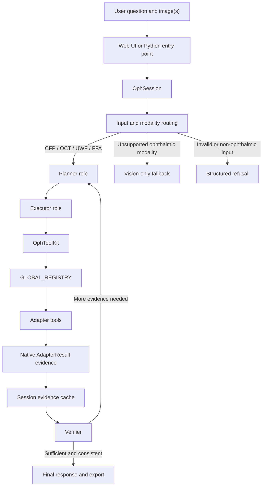

# Tutorial: OphAgent

**Languages:** [English](index.md) | [简体中文](../zh-CN/index.md)

OphAgent is a **tool-using, multimodal ophthalmology assistant**. It accepts an
ophthalmic image or volume together with a clinical question, identifies the
input modality, selects compatible specialist tools, preserves their native
outputs as evidence, and checks that evidence before producing a response.

The central **`OphSession`** coordinates the process. It keeps the conversation
and attached images, exposes the available tools through **`OphToolKit`**, and
uses an effort policy to bound planning and verification. Model adapters
self-register in **`GLOBAL_REGISTRY`**, allowing CFP, OCT, UWF, FFA, paired
modalities, and OCT volumes to share one execution interface. Results are
stored in the session context so follow-up questions can reuse prior evidence
instead of running the same model again.

**Source repository:** [https://github.com/PyJulie/OphAgent](https://github.com/PyJulie/OphAgent)

> [!CAUTION]
> OphAgent is for research and decision support. Its outputs must be reviewed
> with the patient's history, examination, and available imaging by a qualified
> clinician.

## Chapters

1. [The Session Engine](01_session_engine.md)  
   Follow one case from `OphSession.new()` to a saved, multi-turn result.

2. [Providers and Model Roles](02_provider_and_model_roles.md)  
   Configure the main reasoning model, optional vision model, and
   verification roles without storing credentials in the session.

3. [Multimodal Input Routing](03_multimodal_input_routing.md)  
   Understand image validation, modality detection, scope decisions, multiple
   attachments, and OCT volumes.

4. [Tool Registry and Adapters](04_tool_registry_and_adapters.md)  
   See how heterogeneous clinical models share `ToolMetadata`,
   `AdapterResult`, and a lazy-loading registry.

5. [Planning and Effort Policies](05_planning_and_effort_policies.md)  
   Learn how tool-calling forms the planner role and how deterministic effort
   policies bound tool rounds and verification.

6. [The Executor: Dispatch and Evidence](06_executor_and_evidence.md)  
   Follow a structured tool call through policy guards, argument handling,
   toolkit dispatch, adapter inference, evidence caching, and UI events.

7. [Verification and Safe Stopping](07_verification_and_safe_stopping.md)  
   Interpret verifier inputs, outputs, escalation, conflict handling, and
   insufficient-evidence states.

8. [Web UI and Exports](08_web_ui_and_exports.md)  
   Connect the FastAPI routes, live tool events, per-user sessions, model
   settings, interruption, and self-contained report export.

9. [Extending OphAgent](09_extending_ophagent.md)  
   Add a new ophthalmic model adapter without changing the central
   planner-executor-verifier loop.

## A useful reading order

For users operating the Web UI, read Chapters 1, 2, 3, 7, and 8 first.
Developers adding models should continue through Chapters 4, 5, 6, and 9.

---

Next: **[Chapter 1 - The Session Engine](01_session_engine.md)**
