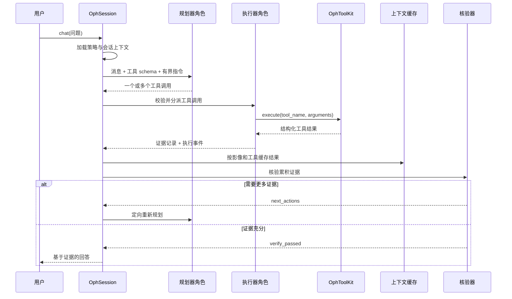

# 第 1 章：会话引擎

理解 OphAgent 最合适的入口是 `OphSession`。它是一次对话的持久协调器：
记录所选模型、接收影像、保留既往消息、向推理模型暴露工具、缓存工具输出、
调用核验，并保存最终状态。

可以把 `OphSession` 理解为一个眼科病例讨论的协调者。它不会替代专科工具，
而是负责整理病例，并决定何时需要再获取一种专科意见。

## 最小化的程序化会话

```python
from ophagent.chat.oph_session import OphSession

session = OphSession.new(
    backend="openai",
    model="gpt-5",
    effort="medium",
)

session.set_image("example_cfp.jpg")
reply = session.chat(
    "Describe the main abnormality and state what additional evidence "
    "would be useful."
)

print(reply)
saved_path = session.save()
print(f"Session saved to: {saved_path}")
```

该示例使用真实的公开方法：

1. `OphSession.new(...)` 创建具有唯一标识符的会话。
2. `set_image(...)` 校验文件，并判断该输入允许进入哪种路由。
3. `chat(...)` 运行有界的规划、执行和核验循环。
4. `save(...)` 将对话和上下文序列化为 JSON。

该示例假定所选供应商和必需工具资源已经配置。API 密钥缺失或权重不可用时，
系统应返回明确错误，而不应静默退化为诊断猜测。

## 会话保存哪些内容

`OphSession` 将对话级配置与病例级上下文分开。

| 区域 | 示例 |
|---|---|
| 模型配置 | `backend`、`model`、`effort`、可选角色专用模型 |
| 对话 | `messages`、`created_at`、`last_active`、`owner` |
| 当前输入 | `current_image`、`current_volume`、`current_modality` |
| 多个输入 | `attached_images` |
| 证据记忆 | `analyses`，按影像和工具索引 |
| 审计状态 | `last_run_policy`、`last_report` |

嵌套的 `OphContext` 对象保存所附影像和工具证据。一次对话可以包含多个轮次
和多种模态，因此必须避免把模型配置与临床证据混在一起。

## 一次对话轮次的内部过程

调用 `session.chat(...)` 不只是向模型发送一段文本。



该生命周期受到明确限制。`chat()` 会统计规划轮次、核验升级次数和重复工具
调用，也可以响应 Web 服务器发出的外部中断。

## 多轮对话中的证据复用

假设第一轮运行了质量工具、疾病分类器和病灶分割器。随后用户问：

> 病灶相对于黄斑中心凹位于什么位置？

系统不会自动重新运行全部三个工具。会话会先检查
`context.analyses` 中保存的证据。如果所需结果已经存在，就可以直接复用；
只有后续问题需要尚不存在的证据时，才调用新工具。

因此，真正的交互单元是会话，而不是一次孤立的模型调用。

## 保存与加载

```python
from ophagent.chat.oph_session import OphSession

path = session.save()
restored = OphSession.load(path)

print(restored.session_id)
print(len(restored.messages))
print(restored.context.current_modality)
```

凭据和活动客户端对象会被有意排除在保存的 JSON 之外。恢复后的会话必须从运行
环境或已认证的 Web 服务器重新获得凭据。

## 源码定位

| 职责 | 源码路径 |
|---|---|
| `OphContext` 与 `OphSession` | `ophagent/chat/oph_session.py` |
| 执行强度策略 | `ophagent/chat/run_policy.py` |
| 工具门面 | `ophagent/chat/oph_tools.py` |
| 供应商客户端 | `ophagent/chat/api_config.py` |
| Web 会话持久化 | `ophagent/webchat/server.py` |

## 小结

`OphSession` 是一次 OphAgent 对话的有状态边界。它连接输入、模型、工具、
证据、核验和持久化，同时让每项职责保持明确。

---

上一页：**[教程首页](index.md)**  
下一章：**[第 2 章——供应商与模型角色](02_provider_and_model_roles.md)**
