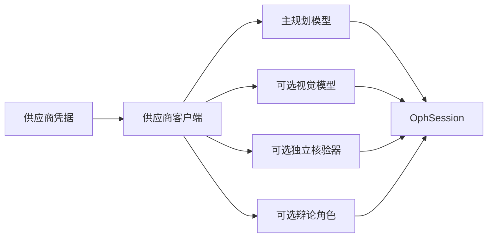

# 第 2 章：供应商与模型角色

OphAgent 将**模型托管在哪里**与**模型在系统中承担什么角色**分开。这使主工具
调用模型、可选视觉模型和核验角色既可以使用同一供应商，也可以分别使用不同的
兼容供应商。

一个重要的运行边界是：凭据由运行时提供，不会写入 `OphSession` JSON。

## 支持的供应商接口

统一供应商配置位于 `ophagent/chat/api_config.py`。当前供应商标识符包括：

| 供应商 ID | 典型用途 |
|---|---|
| `openai` | OpenAI API |
| `openrouter` | OpenRouter 的 OpenAI 兼容端点 |
| `dashscope` | DashScope 兼容模式端点 |
| `aigcbest` | 已配置的 OpenAI 兼容网关 |

`resolve_provider_connection(...)` 会优先选择已认证用户的个人覆盖配置；若不
存在，则回退到环境配置。随后，`create_provider_client(...)` 创建一个
OpenAI 兼容客户端。

## 配置私有运行环境

凭据、权重、报告和缓存应保存在源码目录之外。

```powershell
New-Item -ItemType Directory -Force "$HOME\ophagent-runtime"
Copy-Item .env.example "$HOME\ophagent-runtime\.env"

$env:OPHAGENT_RUNTIME_DIR = "$HOME\ophagent-runtime"
$env:OPH_WEB_BACKEND = "openai"
$env:OPH_WEB_MODEL = "gpt-5"
$env:OPENAI_API_KEY = "<your-key>"
$env:OPH_WEB_EFFORT = "medium"
```

不要提交运行时 `.env` 文件。

## 模型角色

一个 `OphSession` 包含一个主规划器/编排模型，以及可选的角色专用覆盖模型。

| 角色 | 会话字段 | 用途 |
|---|---|---|
| 主规划器与综合器 | `backend`、`model` | 读取对话、调用工具并撰写最终回答 |
| 视觉回退 | `vision_backend`、`vision_model_override` | 在需要独立视觉模型时处理有限视觉印象或模态检查 |
| 独立核验器 | `verifier_backend`、`verifier_model` | 在相应执行强度下复核原始工具证据 |
| 辩论核验器 | `debate_backend`、`debate_model` | 支持有界辩论核验模式 |

如果没有提供覆盖配置，该角色通常回退到会话的主 `backend` 和 `model`。



## 为什么需要独立视觉模型

支持工具调用的推理模型不一定具备视觉能力。因此，OphAgent 会独立解析视觉
角色：

1. 有明确配置的视觉模型时，优先使用该模型。
2. 否则，如果主模型已知支持视觉，则使用主模型。
3. 如果两者都不满足，则跳过仅视觉分析，不会把影像发送到纯文本端点。

Web 运行时对应的可选配置为：

```text
OPH_WEB_VISION_BACKEND
OPH_WEB_VISION_MODEL
```

通过这种分离方式，偏文本的规划器仍可调用经过校准的专科工具，而专用多模态
模型只承担有限的视觉回退角色。

## 用户级 Web 设置

已认证的 Web UI 用户可在 **Personalize** 中保存供应商密钥和可选的兼容
`base URL`。服务器把密钥保存在私有运行目录下，并且绝不会把密钥本身返回给
浏览器。

界面还提供定向连接检查。检查通过表示供应商、鉴权和所选模型可以访问，但不
代表临床性能已经得到验证。

## 模型设置与执行策略

模型选择与执行强度策略相互关联，但含义不同：

- 模型决定一次 LLM 调用如何理解提示和工具 schema。
- 执行强度策略决定允许的规划轮次、核验模式、工具广度和升级预算。

更换模型不应静默改变与供应商无关的生命周期。第 5 章将详细介绍这些策略。

## 程序化角色配置

```python
from ophagent.chat.oph_session import OphSession

session = OphSession.new(
    backend="dashscope",
    model="qwen3-vl-plus",
    vision_backend="openai",
    vision_model_override="gpt-5",
    verifier_backend="openai",
    verifier_model="gpt-5",
    effort="high",
)
```

该操作只创建配置。各角色客户端会在首次真正需要时延迟创建。

> [!IMPORTANT]
> 只有所选端点支持相应能力时，角色专用配置才有意义。在允许分析流水线运行前，
> Web UI 会检查主模型是否支持工具调用。

## 源码定位

| 职责 | 源码路径 |
|---|---|
| 供应商规范与客户端 | `ophagent/chat/api_config.py` |
| 会话角色字段与延迟客户端 | `ophagent/chat/oph_session.py` |
| Web 模型目录 | `ophagent/webchat/models_catalog.py` |
| 用户级 API 设置 | `ophagent/webchat/server.py` |
| 环境变量模板 | `.env.example` |

## 小结

OphAgent 将模型视为可替换的角色 backbone，同时把凭据和生命周期策略保留在
保存的临床会话之外。这样可以灵活配置模型，而不会让审计轨迹产生歧义。

---

上一章：**[第 1 章——会话引擎](01_session_engine.md)**  
下一章：**[第 3 章——多模态输入路由](03_multimodal_input_routing.md)**
