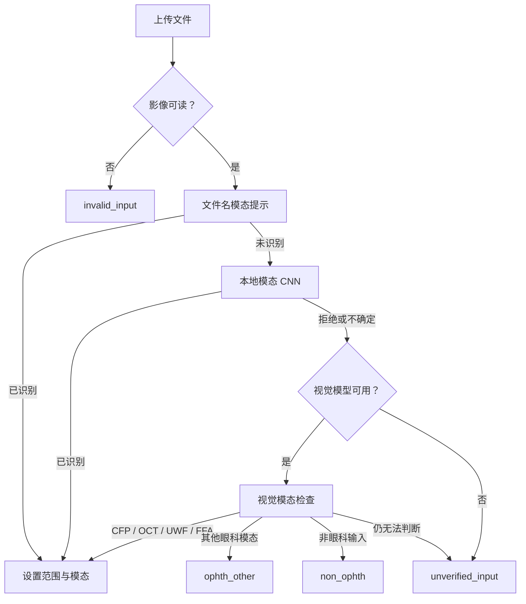
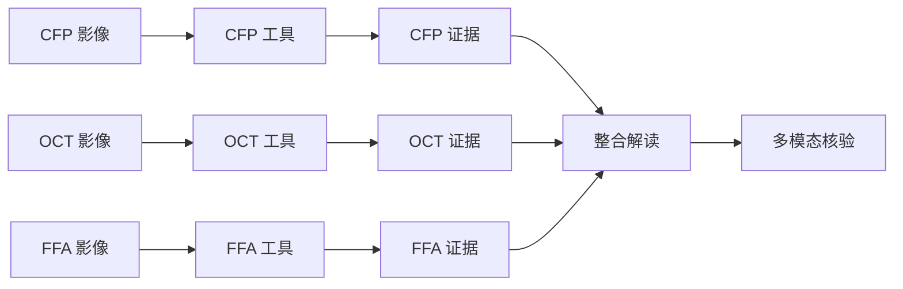

# 第 3 章：多模态输入路由

在选择眼科模型前，OphAgent 必须先确定收到的输入类型，并判断该输入是否处于
支持的临床范围内。因此，模态路由是一项安全前提，而不是一个装饰性标签。

OphAgent 当前为 **CFP**、**OCT**、**UWF** 和 **FFA** 提供专科流水线，
同时支持部分配对模态工具和 OCT volume 工具。

跟随下方影像路由示例时，只能使用已获发布许可、完成去标识化或获准公开使用的
示例影像。临床输入应保存在私有运行目录中，不得提交到源码仓库。

## 登记影像

```python
from ophagent.chat.oph_session import OphSession

session = OphSession.new(
    backend="openai",
    model="gpt-5",
    effort="medium",
)

session.set_image("example_cfp.jpg")
print(session.context.current_modality)
print(session.context.modality_scope)
```

`set_image(...)` 首先确认路径指向可读影像，并检查影像尺寸是否位于配置的安全
限制内。随后，它按以下阶梯执行路由。



该路由阶梯会有意避免把不确定输入强行放入外观最相近的专科流水线。

## 范围状态

`OphContext.modality_scope` 记录最终路由分支。

| 范围状态 | 含义 | 对话行为 |
|---|---|---|
| `in_scope` | 支持的 CFP、OCT、UWF 或 FFA 输入 | 运行规划器—执行器—核验器流水线 |
| `ophth_other` | 属于眼科，但没有对应专科流水线，例如视野或 OCT-A | 条件允许时给出受限的仅视觉回答 |
| `non_ophth` | 输入不是眼科内容 | 返回结构化拒绝 |
| `unverified_input` | 无法确定眼科范围 | 拒绝进入诊断工具路由 |
| `invalid_input` | 文件缺失、不可读或未通过校验 | 返回无效输入响应 |

这些分支会在 `OphSession.chat(...)` 开始时、正常工具循环运行前进行检查。

## 一个会话中的多张影像

每张已接受影像都会追加到 `context.attached_images`，其中保存路径、模态、
文件名和上传时间。重复附加同一路径会更新现有条目，而不是创建第二份副本。

```python
session.set_image("right_eye_cfp.jpg")
session.set_image("right_eye_oct.jpg")

for item in session.context.attached_images:
    print(item["modality"], item["filename"])

reply = session.chat(
    "Integrate the colour fundus and OCT findings, preserving the evidence "
    "from each modality."
)
```

只有附加至少两种不同的受支持模态时，OphAgent 才进入多模态模式。两张 CFP
仍然属于单模态会话。

## 模态专用证据与整合证据

会话先从每个模态的适用工具中收集证据，然后才能形成整合结论。



多模态完成保护会检查每个已附加且受支持的模态是否都有核心证据。如果某一模态
缺少证据，会话可以请求修复步骤，而不会把只得到部分支撑的整合结果当作已经
完成。

## OCT volume

Volume 通过独立方法登记：

```python
session.set_volume("path/to/oct_volume_or_series")
print(session.context.current_volume)
```

Volume 级适配器可以接收 DICOM 序列或受支持的 volume 结构。其输出应保留
代表性切片或衍生图像的链接，使 volume 总结能够回溯到底层扫描。

## 证据缓存键

面向 Web 的模型路径可能是相对路径，而服务器路径可能是绝对路径。OphAgent
在把路径作为缓存键前，会通过会话分析键将不同形式规范化。这可以避免同一影像
产生两份独立的证据历史。

概念上：

```text
context.analyses = {
    "<canonical image path>": {
        "cfp_eyeq": { ... },
        "cfp_clip_ensemble": { ... },
        "cfp_retsam_segmentation": { ... }
    }
}
```

## 源码定位

| 职责 | 源码路径 |
|---|---|
| 影像校验与范围路由 | `ophagent/chat/oph_session.py` |
| 文件名、CNN 与视觉模态检查 | `ophagent/chat/oph_tools.py` |
| OCT volume 适配器 | `ophagent/adapters/oct_volume/` |
| 多模态完成保护 | `ophagent/chat/oph_session.py` |
| 上传端点 | `ophagent/webchat/server.py` |

## 小结

输入路由会在诊断前确定三个问题：输入是否有效、是否属于眼科，以及 OphAgent
是否具备支持该输入的专科流水线。多模态推理建立在彼此分开且可追溯的模态专用
证据之上。

---

上一章：**[第 2 章——供应商与模型角色](02_provider_and_model_roles.md)**  
下一章：**[第 4 章——工具注册表与适配器](04_tool_registry_and_adapters.md)**
