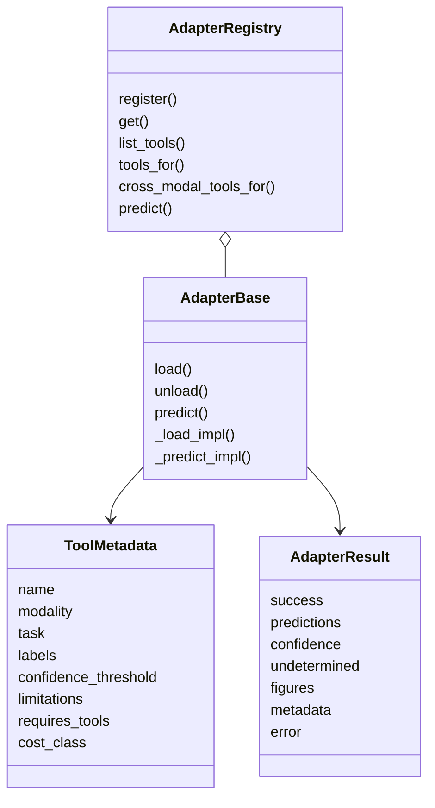
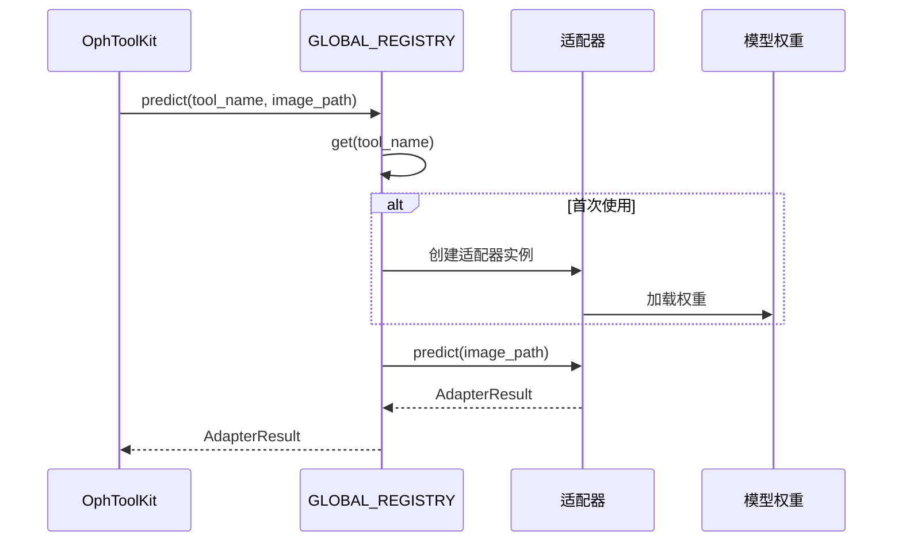

# 第 4 章：工具注册表与适配器

OphAgent 集成了由不同团队训练的模型。这些模型具有不同依赖、输入尺寸、标签
空间和输出格式。适配器层将这些异构模型转换为统一的工具接口。

核心思想很简单：

> 规划器不需要了解权重如何加载。它需要知道工具做什么、接受什么模态、返回
> 什么证据，以及存在哪些限制。

## 四个适配器基础组件

统一接口定义在 `ophagent/adapters/base.py`。

| 组件 | 职责 |
|---|---|
| `ToolMetadata` | 描述工具名称、模态、任务、标签、置信度阈值、依赖、成本与限制 |
| `AdapterResult` | 承载统一后的预测、置信度、不确定性、图像、元数据和错误 |
| `AdapterBase` | 定义延迟加载和预测生命周期 |
| `AdapterRegistry` | 注册适配器类，并为每个工具创建一个缓存实例 |

所有已导入的适配器都会注册到进程级 `GLOBAL_REGISTRY`。



## 不运行推理也能检查注册表

导入 `ophagent.adapters` 会导入各模态包并触发其 `@register` 装饰器。仅列出
元数据时不会加载模型权重。

```python
from ophagent.adapters import GLOBAL_REGISTRY

for tool in GLOBAL_REGISTRY.list_tools():
    print(
        f"{tool.name:32s} "
        f"{tool.modality:8s} "
        f"{tool.task:16s} "
        f"{tool.cost_class}"
    )
```

按模态筛选：

```python
cfp_tools = GLOBAL_REGISTRY.list_tools(modality="CFP")
for tool in cfp_tools:
    print(tool.name, tool.description)
```

如果 Windows 终端无法显示包含 Unicode 的元数据，可使用 UTF-8 模式：

```powershell
python -X utf8 -c "from ophagent.adapters import GLOBAL_REGISTRY; print([x.name for x in GLOBAL_REGISTRY.list_tools()])"
```

## 延迟加载模型

只有真正需要某项工具时，`AdapterRegistry.get(...)` 才创建适配器实例。
`AdapterBase.predict(...)` 会在首次使用时调用 `load()`。



加载过程会在线程间串行化，避免延迟导入时发生竞争，也避免同时分配多个大型
模型。模型加载完成后，推理本身不会被该加载锁全局串行化。

## 统一不确定性

每项工具都有 `confidence_threshold`。当 `_predict_impl(...)` 返回后，
如果主要置信度低于该阈值，`AdapterBase.predict(...)` 会把结果标记为
`undetermined=True`。

因此，一个成功的 `AdapterResult` 可以在技术上有效，但在临床层面仍然不
确定：

```python
{
    "success": True,
    "tool": "example_tool",
    "modality": "CFP",
    "task": "classification",
    "predictions": {"top_label": "example finding"},
    "confidence": 0.43,
    "undetermined": True,
    "figures": {},
    "metadata": {},
    "error": None,
}
```

规划器和核验器都被要求不得将 `undetermined` 结果提升为确定性结论。

## 局部失败，而不是全局失败

多个模态包包含可选依赖或重型依赖。它们的导入彼此隔离，因此一个外部模型不可
用时，不会导致其他所有模态一起失效。

推理阶段发生的适配器异常会转换为失败的 `AdapterResult`，其中保留工具名称
和错误信息。这样，会话可以得到结构化失败，并对其进行报告和审计。

## 工具选择元数据

注册表不只是按字母顺序列出工具：

- `tools_for(modality, task)` 按经过整理的优先使用顺序返回兼容工具。
- `cross_modal_tools_for(modalities)` 返回输入要求已满足的配对模态工具。
- `requires_tools` 记录明确依赖。
- `cost_class` 描述预期执行负担。
- `limitations` 向规划器和核验器提供已知失败模式。

这些元数据使编排层无需导入模型专用实现，也能理解工具能力。

## 当前适配器工具族

| 工具族 | 目录 |
|---|---|
| CFP 分类、质控、分割与疾病专项评估 | `ophagent/adapters/cfp/` |
| OCT 分类、液体/层结构分割与质控 | `ophagent/adapters/oct/` |
| UWF 分类与血管分割 | `ophagent/adapters/uwf/` |
| FFA 分类与病灶检测 | `ophagent/adapters/ffa/` |
| 配对 CFP/OCT 或 CFP/FFA 分析与报告 | `ophagent/adapters/paired/` |
| OCT volume 级分析 | `ophagent/adapters/oct_volume/` |

## 源码定位

| 职责 | 源码路径 |
|---|---|
| 基础类与注册表 | `ophagent/adapters/base.py` |
| 通过导入完成注册 | `ophagent/adapters/__init__.py` |
| 模态包导入 | `ophagent/adapters/<modality>/__init__.py` |
| 工具 schema 包装 | `ophagent/chat/oph_tools.py` |
| 工具资源启用/禁用状态 | `ophagent/checkpoint_config.py` |

## 小结

适配器层是异构眼科模型与统一智能体工作流之间的边界。它通过元数据和统一结果
让模型行为可检查，同时把模型专用加载和推理保留在各自适配器内部。

---

上一章：**[第 3 章——多模态输入路由](03_multimodal_input_routing.md)**  
下一章：**[第 5 章——规划与执行强度策略](05_planning_and_effort_policies.md)**
