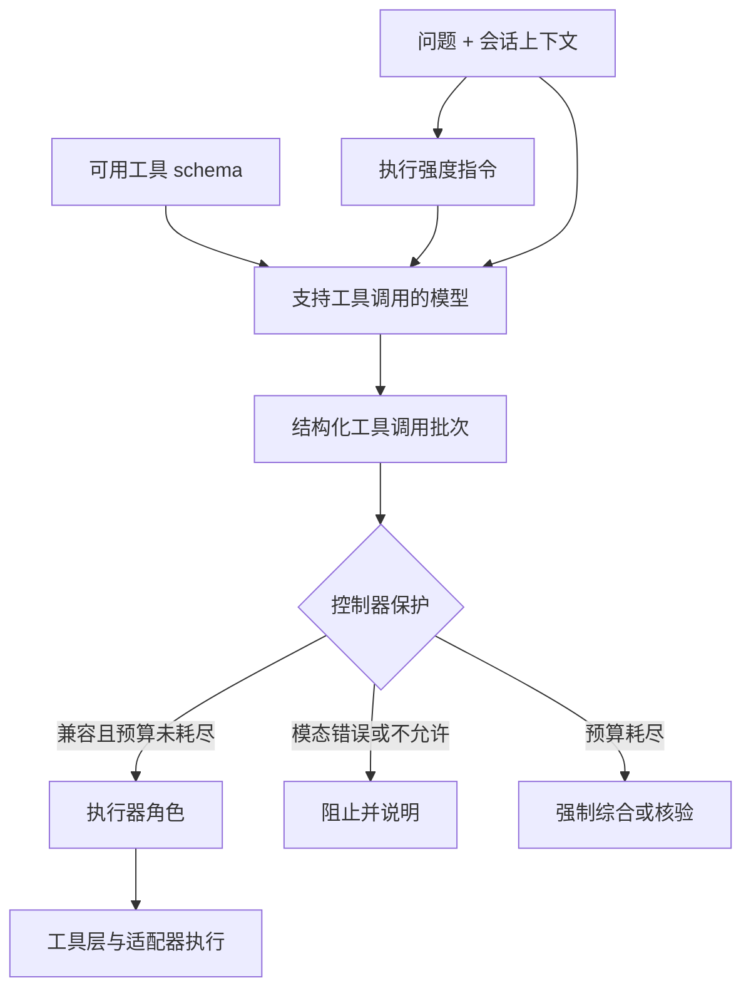

# 第 5 章：规划与执行强度策略

OphAgent 中的规划器是一个**编排角色**，而不是独立的 `Planner` Python 类。
在 `OphSession.chat(...)` 内部，支持工具调用的主模型接收对话、有界策略
指令以及兼容工具 schema。它返回的结构化工具调用共同构成计划。

这一区分很重要，因为规划包含两个层次：

1. 模型判断当前问题需要哪一种允许的操作。
2. 确定性控制器策略限制规划和核验可以运行多少轮，并规定所需的核验模式。

语言模型提出操作，但不拥有完整生命周期。

## 从 schema 到计划

`OphToolKit.get_all_schemas()` 以 OpenAI 兼容的函数调用格式暴露已注册
工具。会话还会加入：

- 对话历史；
- 当前影像与模态上下文；
- 支持和不支持的任务信息；
- 对应执行强度的指令；
- 当前提示配置允许暴露的工具 schema；
- 由控制器执行的停止与核验规则。

随后，模型可以在一次规划轮次中返回一个或多个工具调用。



## 执行强度策略

`ophagent/chat/run_policy.py` 是与供应商无关的执行策略事实来源。

| 执行强度 | 规划轮次 | 核验升级 | 核验模式 | 视觉模式 | 最终核验 | 工具广度 |
|---|---:|---:|---|---|---|---|
| `low` | 1 | 0 | controller rule | disabled | 否 | 一个优先兼容工具 |
| `medium` | 2 | 1 | structured rule | targeted | 是 | 最多两个兼容工具 |
| `high` | 3 | 1 | independent LLM | targeted | 是 | 最多三个兼容工具 |
| `max` | 4 | 2 | bounded debate | targeted | 是 | 最多四个兼容工具 |
| `ultra` | 5 | 2 | bounded debate | exhaustive | 是 | 全部兼容工具 |

这些行代表执行配置，并不意味着调用更多工具一定会改善临床回答。

直接检查某项策略：

```python
from ophagent.chat.run_policy import get_effort_policy

policy = get_effort_policy("high")
print(policy.to_dict())
```

## 规划轮次与工具数量不同

一次规划轮次可以包含并行工具调用。因此：

- `plan_rounds=2` 不表示最多只能运行两个工具；
- 一个复合工具可能调用或组合多个底层模型；
- 多模态病例可能获得更高的最低轮次预算，使每个附加模态都能取得核心证据；
- 核验升级预算与初始规划预算分开计算。

这种分离可以防止规划器在核验请求修复前耗尽整个生命周期预算。

## 工具兼容性经过双重检查

规划器会收到可行性说明，帮助其避免无关调用；控制器还会执行代码级检查：

1. **指令级路由：** 告知模型哪些工具适合当前模态与任务。
2. **执行级保护：** 即使模型仍提出请求，也阻止模态不匹配的调用。

当同一会话可以看到多个模态的 schema 时，这一机制尤其重要。

## 新影像证据要求

对于刚附加、处于支持范围内且尚无缓存分析的新影像，会话会强制第一次操作进入
工具流水线。一般推理模型直接给出的影像诊断不能替代经过校准的工具证据。

后续轮次不同：如果会话中已经存在结构化证据，规划器可以复用这些证据。

## 提示配置

默认 `standard` 配置保留完整交互体验。面向特定评估场景的聚焦配置可以减少
无关提示和工具 schema 上下文。

提示配置会改变提示和可见 schema，但不会绕过会话的模态、证据、循环或核验
保护。

```python
from ophagent.chat.oph_session import OphSession

standard = OphSession.new(prompt_profile="standard")
focused = OphSession.new(prompt_profile="compact-mac")
```

聚焦配置属于显式选择；在可复现实验中应明确写出其名称。

## 为什么需要控制器

如果没有控制器，支持工具调用的模型可能：

- 反复调用同一工具；
- 为错误模态请求工具；
- 在取得核心证据前停止；
- 证据已经充分后仍继续开启新的规划轮次；
- 忽略核验器要求的定向下一步操作；
- 证据更新后未经重新核验就生成最终回答。

`OphSession.chat(...)` 会独立于模型文本追踪这些状态。

## 源码定位

| 职责 | 源码路径 |
|---|---|
| 工具调用规划循环 | `ophagent/chat/oph_session.py` |
| 确定性执行强度策略 | `ophagent/chat/run_policy.py` |
| 提示与 schema 配置 | `ophagent/chat/prompt_profiles.py` |
| 工具 schema | `ophagent/chat/oph_tools.py` |
| 模型能力目录 | `ophagent/webchat/models_catalog.py` |

## 小结

OphAgent 将模型驱动的规划与确定性的生命周期控制结合起来。模型从允许的操作中
做出选择；会话决定流程可以持续多久、哪些证据不可缺少，以及何时必须核验。

---

上一章：**[第 4 章——工具注册表与适配器](04_tool_registry_and_adapters.md)**  
下一章：**[第 6 章——执行器](06_executor_and_evidence.md)**
