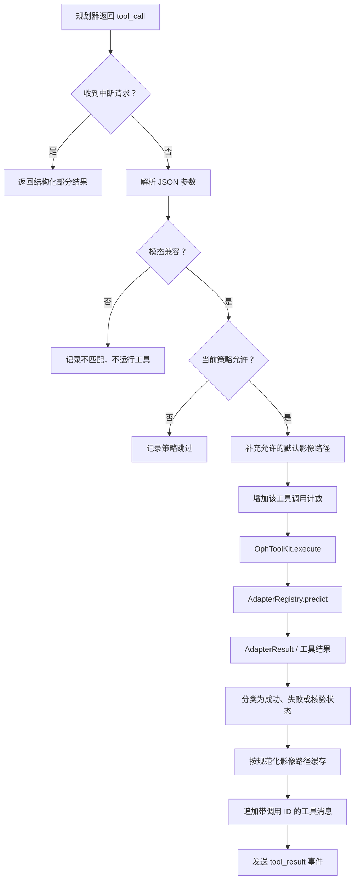
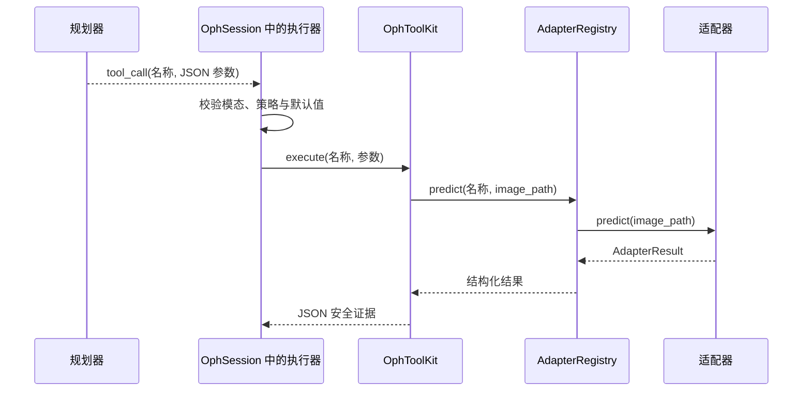

# 第 6 章：执行器

规划器决定**请求什么操作**。执行器负责把该请求变得安全、具体、可观察且可
持久保存。

在 OphAgent 的主多模态运行时中，执行器是一个架构角色，而不是单独的
`Executor` 类。其实现分布在三个相互协作的层次中：

1. `OphSession.chat(...)` 校验并分派模型生成的工具调用。
2. `OphToolKit.execute(...)` 解析工具名称并调用对应函数。
3. `AdapterRegistry.predict(...)` 获取延迟加载的适配器并运行模型推理。

这三层共同构成对话式 Web UI 实际使用的执行器路径。

## 规划器与执行器承担不同职责

规划器接收问题、上下文、策略和工具 schema。它可能返回如下结构化工具调用：

```json
{
  "id": "call_01",
  "type": "function",
  "function": {
    "name": "cfp_eyeq",
    "arguments": "{\"image_path\":\"right_eye.jpg\"}"
  }
}
```

此时规划器只是提出了一个操作，工具尚未真正运行。

接下来，执行器必须：

- 解析参数；
- 响应中断；
- 拒绝模态不匹配的调用；
- 应用策略跳过和核验完成后的关闭状态；
- 在允许的情况下补充默认影像路径；
- 统计重复调用；
- 调用工具层；
- 捕获格式错误的参数和运行时失败；
- 测量执行时间；
- 将结果分类为成功、失败或跳过；
- 把结果缓存到正确的影像与工具项下；
- 使用匹配的 `tool_call_id` 追加工具消息；
- 向 Web UI 发送结构化事件。

这些操作属于确定性的控制器行为，不是额外的模型推理。

## 完整分派路径



## 第 1 步：保留模型提出的调用

当模型回答包含 `tool_calls` 时，`OphSession.chat(...)` 会先保存该助手
记录，其中包括每项调用的 ID、名称和原始参数字符串。这样，在执行过程修改或
规范化任何内容前，规划器的原始请求已经被保留。

如果后续中断阻止某项调用运行，会话会补齐协议所需的工具响应记录，使保存的
对话在下一次模型请求时仍然有效。

## 第 2 步：解析并校验参数

工具调用参数以 JSON 文本传入：

```python
try:
    args = json.loads(tool_call.function.arguments or "{}")
except json.JSONDecodeError:
    args = {}
```

随后，执行器在代码中检查模态兼容性。为 UWF 影像请求 CFP 工具时，系统会记录
模态不匹配，并且不执行该工具。

即使规划器已经收到模态说明，这项检查仍然不可缺少。提示指令可以减少错误请求，
执行器保护则阻止错误请求真正到达模型。

## 第 3 步：补充默认值，但不虚构参数

模型有时会遗漏 `image_path`。只有所选工具声明的 schema 确实包含
`image_path` 参数时，OphAgent 才会补入当前影像路径。

这样可以避免盲目向代码沙箱或核验器等具有不同契约的工具传入影像参数。

## 第 4 步：应用执行策略

分派前，执行器会根据当前生命周期状态判断所请求的工具是否应该运行。例如：

- 当前执行策略排除了该工具；
- 最终核验器已经关闭证据收集，后续调用不再必要；
- 核验器的 `next_actions` 未授权该工具；
- 循环保护计数器发现同一工具被重复调用。

策略跳过会被保留为结构化结果，不会被报告为模型推理。

## 第 5 步：通过工具层分派

中央调用在概念上很简单：

```python
result = session._toolkit.execute(tool_name, **args)
```

`OphToolKit` 解析已注册函数。对于由适配器支持的工具，该函数继续调用：

```python
GLOBAL_REGISTRY.predict(tool_name, image_path, **adapter_arguments)
```

注册表创建或复用适配器实例；`AdapterBase.predict(...)` 在首次使用时加载
权重；`_predict_impl(...)` 执行模型专用推理。



一次模型回答可以包含多个工具调用。`OphSession` 会通过同一个受保护循环逐项
分派这些调用，并为每项调用保留独立结果。

## 第 6 步：分类执行结果

当结果包含顶层错误，或明确报告 `success=False` 时，执行器会把该工具标记
为失败。策略跳过具有独立状态。

核验器调用还需要额外的有效性检查。核验结果必须是机器可读的，包含布尔型
`verify_passed`；如果没有审阅任何工具，也不能声称正常通过。

该结果状态会继续进入后续的证据充分性保护。

## 第 7 步：保存证据与来源信息

结果按规范化输入键缓存：

```python
session.context.analyses = {
    "<canonical image path>": {
        "cfp_eyeq": { ... },
        "cfp_clip_ensemble": { ... }
    }
}
```

会话还会追加一条 `role="tool"` 消息，其中包含：

- 原始 `tool_call_id`；
- 工具名称；
- 根据当前提示配置准备的 JSON 安全结果。

当规划器在一批中返回多个调用，且这些结果随后出现在导出轨迹中时，精确的调用
ID 配对尤其重要。

## 第 8 步：发送可观察的执行事件

执行器发送的事件包括：

```text
tool_call:
  name
  arguments

tool_result:
  name
  preview
  elapsed_s
  structured result
  predictions or error
  optional figure URLs
```

会话运行时，Web UI 使用这些事件显示进度和工具级详细信息。同一结构化结果
还会保留给核验和导出流程。

## 证据记忆与后续复用

执行器缓存有三项用途：

- **效率：** 后续问题可以使用未改变的工具结果，避免不必要的重复计算。
- **一致性：** 后续推理使用同一份证据记录。
- **可追溯性：** 核验和导出可以恢复支持回答的准确工具结果。

如果后续问题需要的证据尚不存在，仍会运行新工具。该缓存属于会话上下文，而
不是纵向临床数据库。

## 执行器失败边界

| 条件 | 执行器行为 |
|---|---|
| JSON 参数无效 | 使用空对象，再交由 schema 校验或返回结构化错误 |
| 缺少必需参数 | 返回带修复提示的类型化参数错误 |
| 模态错误 | 不运行工具，记录模态不匹配 |
| 工具被禁用或策略已关闭 | 记录策略跳过 |
| 适配器加载或推理失败 | 保留结构化错误 |
| 用户中断 | 在下一次分派前停止，并保留有效历史 |
| 同一工具反复调用 | 触发有界循环保护 |

最终综合器不能把这些失败改写成成功证据。

## 源码定位

| 执行器职责 | 源码路径 |
|---|---|
| 工具调用解析、保护、分派、计时、缓存与事件 | `ophagent/chat/oph_session.py` |
| 工具名称与 schema 解析 | `ophagent/chat/oph_tools.py` |
| 适配器查找与预测 | `ophagent/adapters/base.py` |
| 工具层复用的 schema 数据类型 | `ophagent/agent/tools/oct_tools.py` |
| 浏览器流式事件 | `ophagent/webchat/server.py` |
| 导出中的调用 ID 与结果配对 | `ophagent/webchat/export.py` |

## 小结

执行器是模型提出工具调用与持久证据记录之间的受控边界。它阻止不恰当调用，
运行所选能力，保存来源信息，并将结果提供给规划器、核验器、Web UI 与导出
流程。

---

上一章：**[第 5 章——规划与执行强度策略](05_planning_and_effort_policies.md)**  
下一章：**[第 7 章——核验与安全停止](07_verification_and_safe_stopping.md)**
