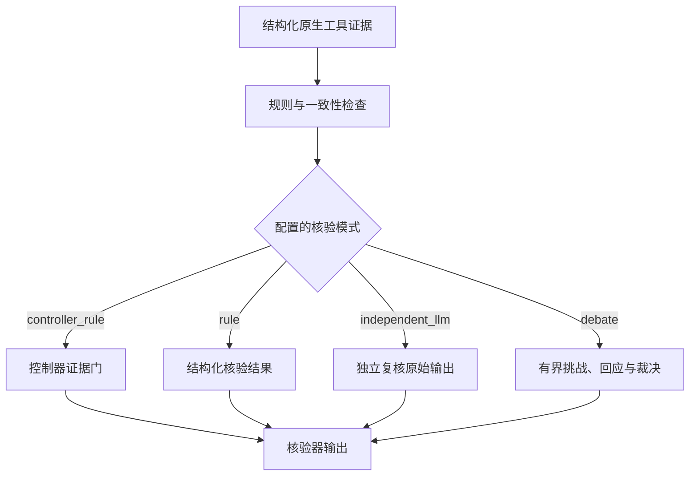
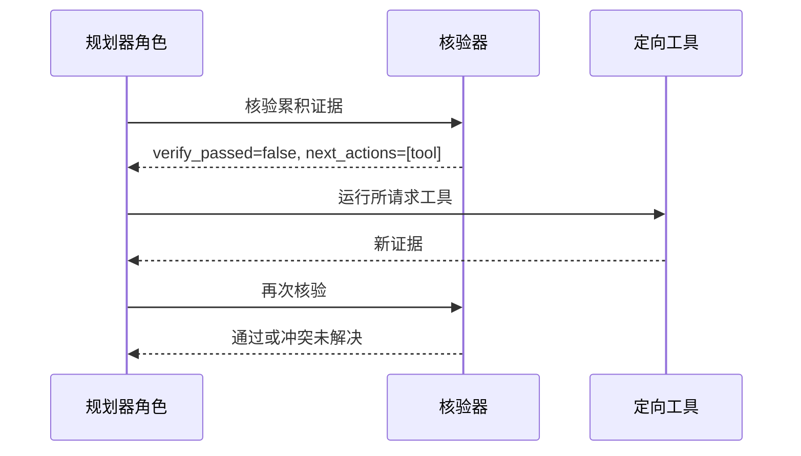

# 第 7 章：核验与安全停止

OphAgent 的核验器检查累积的工具证据对于当前准备生成的回答是否充分、内部是否
一致。它可以暴露冲突、请求一次定向后续操作，或要求最终回答保留不确定性。

核验是一层安全和可追溯机制，但它不能证明临床结论一定正确。

## 核验器输入

`verify_findings` 工具接受一个可选 JSON 对象：

```json
{
  "tools_run": [
    "cfp_eyeq",
    "cfp_clip_ensemble"
  ],
  "results": [
    {
      "tool": "cfp_eyeq",
      "predictions": {
        "quality": "Usable"
      },
      "confidence": 0.91,
      "undetermined": false
    },
    {
      "tool": "cfp_clip_ensemble",
      "predictions": {
        "top_label": "example finding"
      },
      "confidence": 0.84,
      "undetermined": false
    }
  ]
}
```

如果模型省略该参数、传入空字符串，或传入 `{}` 等语义为空的对象，核验器会
从会话缓存的工具结果中重建 findings。

空缓存不能被转换为成功核验。一个已完成、机器可读的核验结果必须明确包含布尔型
`verify_passed`；如果存在 `n_tools_run` 字段，其值必须大于零。

## 核验器输出

正常结果包含如下字段：

| 字段 | 含义 |
|---|---|
| `status` | 核验器是否以机器可读方式完成 |
| `input_source` | 输入来自 `provided`，还是从 `session_cache` 重建 |
| `n_tools_run` | 已审阅的结构化证据记录数 |
| `issues` | 阻止正常通过的条件 |
| `warnings` | 质量、置信度、诊断冲突或其他警告 |
| `warning_categories` | 按类型分开的警告 |
| `diagnostic_votes` | 规范化的疾病族证据 |
| `verify_passed` | 当前证据是否满足所配置的检查 |
| `next_actions` | 完成前需要取得的定向证据 |
| `recommendation` | 关于综合或升级的建议 |
| `independent_review` | 可选的独立 LLM 复核 |
| `debate_review` | 可选的有界辩论结果 |

具体可选字段取决于执行强度策略和可用模型角色。

## 核验模式



独立核验器和辩论核验器接收原始工具输出，而不是规划器的私有推理。这可以降低
核验过程只是换一种说法重复规划器偏好结论的风险。

## 核验器检查什么

结构化核验器分别检查以下问题：

1. **证据可用性：** 是否有结构化临床工具成功完成？
2. **质量：** 质量模型是否拒绝影像，或指出解读受限？
3. **置信度：** 关键结果是否低于所配置阈值？
4. **诊断一致性：** 独立工具是否支持相容的疾病族？
5. **核心证据：** 当前模态是否取得完成回答所需的证据？
6. **多模态覆盖：** 每个已附加且受支持的模态是否都提供了核心证据？
7. **新鲜度：** 上一次核验后是否又加入了新证据？

质量警告与疾病级冲突不能互相替代。最终报告应在警告产生的层级保留每种警告。

## 定向升级

如果增加一个工具就可能解决有意义的冲突，核验器可以返回 `next_actions`。



核验升级拥有独立的有界预算。如果预算耗尽后仍存在疾病级冲突，系统应报告带有
不确定性的鉴别诊断，并建议进一步确认，而不是强行输出单一高置信度标签。

## 安全停止状态

| 状态 | 合适的回答 |
|---|---|
| 证据充分且内部一致 | 完成回答，同时保留局部质量或置信度警告 |
| 存在定向下一步操作 | 运行该操作并重新核验 |
| 核验后加入了新证据 | 将旧核验结果视为过期 |
| 核心证据缺失 | 返回证据不足响应 |
| 有界升级后冲突仍存在 | 报告不确定性及建议的后续检查 |
| 工具失败 | 明确报告失败 |
| 用户中断 | 返回已完成证据，不假装流程正常结束 |

## 核验不能替代临床复核

核验器可以发现其所接收证据之间的不一致，但它不能：

- 恢复从未提供的临床病史；
- 保证每项工具都针对当前人群训练；
- 纠正所有底层模型共有的偏倚；
- 在输入和任务支持范围之外确立诊断；
- 替代临床检查或医生责任。

核验器的价值在于让这些边界和证据状态可以被检查。

## 源码定位

| 职责 | 源码路径 |
|---|---|
| `verify_findings` 实现 | `ophagent/chat/oph_tools.py` |
| 核验有效性与新鲜度保护 | `ophagent/chat/oph_session.py` |
| 执行强度到核验模式的映射 | `ophagent/chat/run_policy.py` |
| 核验提示与角色客户端 | `ophagent/chat/oph_session.py` |
| 回归测试 | `tests/test_cfp_hemorrhage_etiology_guard.py` |

## 小结

核验用于判断当前回答是否在配置的策略下获得了充分支撑。它通过区分正常通过、
可修复的证据缺口，以及必须保留不确定性的未解决状态，支持安全停止。

---

上一章：**[第 6 章——执行器](06_executor_and_evidence.md)**  
下一章：**[第 8 章——Web UI 与导出](08_web_ui_and_exports.md)**
