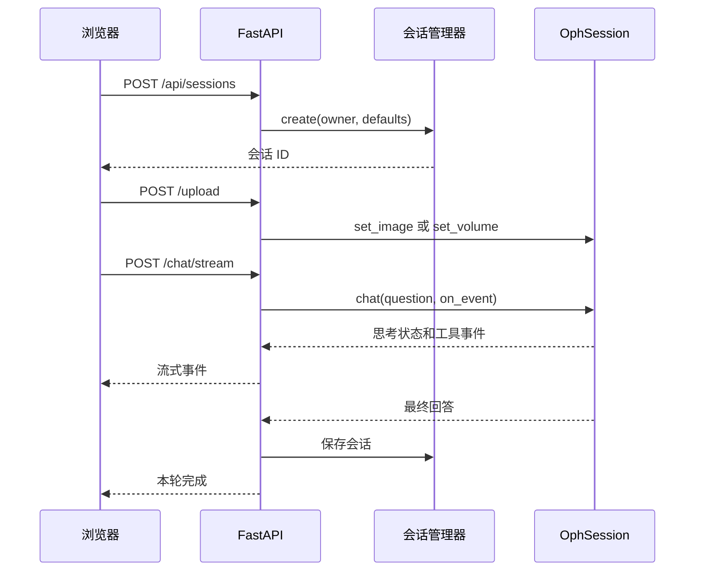
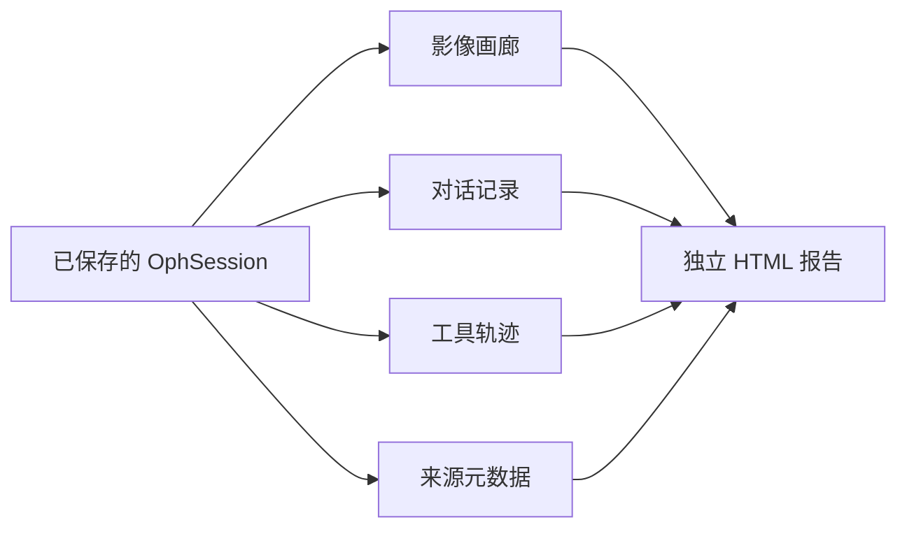

# 第 8 章：Web UI 与导出

OphAgent Web UI 将会话引擎封装为多用户对话服务。FastAPI 路由负责会话、上传、
模型设置、流式工具事件、中断和报告导出，同时避免在浏览器响应中暴露服务器端
凭据和文件系统路径。

## 启动 Web 服务

安装软件包并配置私有运行时后：

```powershell
$env:OPHAGENT_RUNTIME_DIR = "$HOME\ophagent-runtime"
$env:OPH_WEB_HOST = "127.0.0.1"
$env:OPH_WEB_PORT = "8765"

ophagent-web
```

然后打开：

```text
http://127.0.0.1:8765/
```

下面这个轻量级开发入口会启动同一个服务器：

```powershell
python demos/webchat.py
```

## 主要 API

| 方法与路径 | 用途 |
|---|---|
| `POST /api/sessions` | 创建会话 |
| `GET /api/sessions` | 列出当前已认证用户可见的会话 |
| `GET /api/sessions/{sid}` | 加载消息、上下文和显示元数据 |
| `DELETE /api/sessions/{sid}` | 删除会话 |
| `POST /api/sessions/{sid}/upload` | 附加影像或受支持的体数据 |
| `POST /api/sessions/{sid}/model` | 更改供应商、模型或执行强度 |
| `POST /api/sessions/{sid}/chat` | 执行同步对话轮次 |
| `POST /api/sessions/{sid}/chat/stream` | 流式返回思考状态和工具事件 |
| `POST /api/sessions/{sid}/abort` | 请求中断 |
| `GET /api/sessions/{sid}/export` | 导出自包含报告 |
| `GET /api/catalog` | 返回模型和供应商选项 |
| `GET/POST /api/settings/api/...` | 管理并检查个人供应商设置 |
| `GET/POST /api/settings/checkpoints/...` | 管理管理员级工具资源 |

## 一次浏览器对话



服务器会在更改模型或开始对话前取得当前会话的运行锁，防止两个重叠请求同时修改
同一段会话。

## 用户级会话隔离

系统将已认证身份记录为会话所有者。会话的列出、加载、修改、删除和导出都会针对
该身份执行权限检查。

服务支持：

- 仅限本机回环地址开发时使用的本地可信模式；
- 配置 `WEB_USERNAME` 和 `WEB_PASSWORD` 后启用的 Basic Auth；
- 可选的 Cloudflare Access 身份认证，并以 Basic Auth 作为回退。

如果没有配置身份认证，服务器会拒绝绑定到公共网络接口。公开部署还必须遵循所在
机构常规的网络安全、隐私和临床数据治理要求。

## 个人供应商设置

**Personalize** 面板可以：

- 选择供应商及其兼容模型；
- 在服务器端保存用户自己的 API 密钥；
- 为该个人密钥设置可选的兼容 Base URL；
- 单独检查某个供应商或模型配置；
- 记住用户上次选择的供应商、模型和执行强度。

API 只返回状态和配置来源信息，不会返回 API 密钥本身。

管理员专用的工具设置可以启用或停用模型资源，并检查已经配置的 checkpoint 或
数据源路径。大型模型资源仍保留在发布代码目录之外。

## 实时工具事件与中断

流式路由会把 `on_event` 回调传入 `OphSession.chat(...)`。因此，界面可以在一轮
对话运行时持续显示工具调用及其结果。

用户按下停止按钮后，`/api/sessions/{sid}/abort` 会设置该会话的中断标志。执行
循环会在下一次模型调用前检查这个标志，并根据已经完成的证据返回结构化的部分
响应。

## 自包含导出

`build_session_html(...)` 会创建一份独立 HTML 报告，其中包含：

- 文件仍可用时的已附加影像画廊；
- 用户问题与 OphAgent 回答；
- 按顺序排列、带结果预览的工具调用轨迹；
- 以链接或内嵌方式呈现的生成图像；
- 会话与生成过程的元数据。

工具结果通过准确的工具调用标识符与对应调用绑定，因此并行或交错执行不会破坏
导出轨迹。



导出文件是供复核使用的记录，不应暴露 API 密钥或不受限制的服务器文件系统路径。

## 运行检查

在把本地部署视为完整评估环境之前，运行：

```powershell
ophagent-preflight
```

预检流程会检查供应商配置、模块导入、适配器注册、已配置资源和模态覆盖。软件检查
通过，并不等同于系统已在新的人群或工作流程中获得临床有效性验证。

## 源码定位

| 职责 | 源码路径 |
|---|---|
| FastAPI 路由与身份认证 | `ophagent/webchat/server.py` |
| 前端资源 | `ophagent/webchat/static/` |
| 模型目录 | `ophagent/webchat/models_catalog.py` |
| 独立 HTML 导出 | `ophagent/webchat/export.py` |
| Web 启动入口 | `demos/webchat.py` |
| 部署检查 | `ophagent/preflight.py` |

## 小结

Web 层是围绕 `OphSession` 构建的受控界面。它增加了用户所有权、并发运行保护、
私有配置、流式反馈、中断和导出能力，同时没有把临床编排逻辑转移到浏览器中。

---

上一章：**[第 7 章——核验与安全停止](07_verification_and_safe_stopping.md)**  
下一章：**[第 9 章——扩展 OphAgent](09_extending_ophagent.md)**
