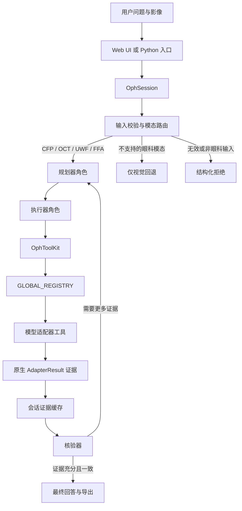

# OphAgent 教程

**语言：**[English](../en/index.md) | [简体中文](index.md)

OphAgent 是一个**使用工具的多模态眼科助手**。它接收眼科影像或 volume
以及临床问题，识别输入模态，选择兼容的专科工具，将工具原生输出保留为证据，
并在生成回答前核验这些证据。

核心 **`OphSession`** 负责协调完整过程。它维护对话与所附影像，通过
**`OphToolKit`** 暴露可用工具，并使用执行强度策略限制规划与核验过程。
模型适配器会自行注册到 **`GLOBAL_REGISTRY`**，因此 CFP、OCT、UWF、
FFA、配对模态和 OCT volume 可以共享同一执行接口。工具结果保存在会话
上下文中，后续问题可以复用已有证据，无需重复运行同一模型。

**源码仓库：** [https://github.com/PyJulie/OphAgent](https://github.com/PyJulie/OphAgent)

> [!CAUTION]
> OphAgent 用于研究和决策支持。所有输出都必须由具备资质的临床人员结合患者
> 病史、检查和现有影像进行复核。

## 章节

1. [会话引擎](01_session_engine.md)  
   从 `OphSession.new()` 开始，跟随一个病例直到获得可保存的多轮结果。

2. [供应商与模型角色](02_provider_and_model_roles.md)  
   配置主推理模型、可选视觉模型和核验角色，同时避免把凭据写入会话。

3. [多模态输入路由](03_multimodal_input_routing.md)  
   理解影像校验、模态识别、范围判断、多附件处理和 OCT volume。

4. [工具注册表与适配器](04_tool_registry_and_adapters.md)  
   了解异构临床模型如何共享 `ToolMetadata`、`AdapterResult` 和延迟加载
   注册表。

5. [规划与执行强度策略](05_planning_and_effort_policies.md)  
   理解工具调用如何构成规划器角色，以及确定性策略如何限制工具轮次与核验。

6. [执行器：分派与证据](06_executor_and_evidence.md)  
   跟随一次结构化工具调用，依次经过策略保护、参数处理、工具分派、适配器
   推理、证据缓存与界面事件。

7. [核验与安全停止](07_verification_and_safe_stopping.md)  
   理解核验器的输入、输出、升级机制、冲突处理和证据不足状态。

8. [Web UI 与导出](08_web_ui_and_exports.md)  
   对应 FastAPI 路由、实时工具事件、用户会话隔离、模型设置、中断和独立报告
   导出。

9. [扩展 OphAgent](09_extending_ophagent.md)  
   在不修改中央“规划器—执行器—核验器”循环的情况下增加新的眼科模型适配器。

## 推荐阅读顺序

使用 Web UI 的读者可优先阅读第 1、2、3、7 和 8 章。需要增加模型的开发者
应继续阅读第 4、5、6 和 9 章。

---

下一章：**[第 1 章——会话引擎](01_session_engine.md)**
